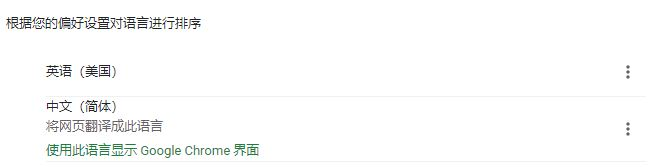

## 5. 国际化

### 国际化基本原理 ###

在Spring程序中，国际化主要是通过ResourceBundleMessageSource这个类来实现的。

Spring Boot通过MessageSourceAutoConfiguration是为我们自动配置好了管理国际化资源文件的组件的:

在org.springframework.boot.autoconfigure.context.MessageSourceAutoConfiguration

主要了解messageSource()这个方法。

方法中首先声明了MessageSourceProperties这个对象

类中首先声明了一个属性basename,默认值为messages。这是一个以逗号分隔的基本名称列表，如果它不包含包限定符（例如“org.mypackage”），它将从类的根路径解析。它的意思是如果你不在配置文件中指定以逗号分隔开的国际化资源文件名称的话，它默认会去类路径下找messages.properties作为国际化资源文件的基本文件。若国际化资源文件是在类路径某个包(如：i18n)下的话，就需要在配置文件中指定基本名称了。

### 配置 ###
```
spring.messages.basename=i18n/login/login
spring.messages.encoding=utf-8
```

### 方式一：默认配置 ###
1. 编写页面
```
<!DOCTYPE html>
<html xmlns:th="http://www.thymeleaf.org">
<head>
    <meta charset="UTF-8"/>
    <title>internationalization</title>
</head>
<body>
<form action="" method="post">
    <label th:text="#{login.username}">Username</label>
    <input type="text"  name="username"  placeholder="Username" th:placeholder="#{login.username}">
    <label th:text="#{login.password}">Password</label>
    <input type="password" name="password" placeholder="Password" th:placeholder="#{login.password}">
    <br> <br>
    <div>
        <label>
            <input type="checkbox" value="remember-me"/> [[#{login.remmber}]]
        </label>
    </div>
    <br>
    <button  type="submit" th:text="#{login.sign}">Sign in</button>
    <br> <br>
    <a>中文</a>
    <a>English</a>
</form>
</body>
</html>
```

2. Controller
```
   @RequestMapping("/international")
   public String international(){

        return "international";
   }
```

3. resource文件
文件位置

messages.properties

messages_en_US.properties

messages_zh_CN.properties

4. 测试

    使用Google浏览器，会根据浏览器的首选语言切换文字。
    **中文**
    > 
    > 

    **英文首选**
    > 
    > 

### 方式二：使用链接切换 ###

国际化语言的切换主要是因为有一个区域信息解析器在其作用。我们可以看一下

org.springframework.boot.autoconfigure.web.servlet.WebMvcAutoConfiguration

这个类，这个类是Spring Boot对SpringMVC功能作自动配置的类。

可以看到，当容器中没有LocaleResolver这个组件的时候，上述方法生成的localeResolver对象就会注册到容器中去。具体看一下AcceptHeaderLocaleResolver这个类。

可以看出，它是根据HttpServletRequest中的locale属性来判定启用哪个语言文件的。

我们的需求是通过点击链接来切换语言，那么我们可以自定义一个区域信息解析器来替代这个默认的解析器。

首先，建立了WebMVCConfig.java这个配置类来扩展Spring Boot对SpringMVC的支持，因为在Spring Boot2.0.4中WebMvcConfigurerAdapter这个适配器类已经不推荐使用了，所以我们采用直接实现WebMvcConfigurer的方式来进行扩展。
1. 配置处理器

    国际化处理器 `LocaleResolver` 

    ```
    public class MyLocaleResolver implements LocaleResolver {
    
        @Override
        public Locale resolveLocale(HttpServletRequest request) {
            String language = request.getParameter("language");
            Locale locale = Locale.getDefault();
            if (!StringUtils.isEmpty(language)) {
                String[] split = language.split("_");
                locale = new Locale(split[0], split[1]);
            }
            return locale;
        }
    
        @Override
        public void setLocale(HttpServletRequest request, HttpServletResponse response, Locale locale) {
    
        }
    
    }
    ```
    将处理器加入配置文件 `MyWebMvcConfig`
    ```
    @Configuration
    public class MyWebMvcConfig implements WebMvcConfigurer {
    
       @Bean
       public LocaleResolver localeResolver(){
           return new MyLocaleResolver();
       }
    }
    ```
2. 页面文件

    页面链接修改为
    ```
    <a th:href="@{/page/internationalbylink(language='zh_CN')}">中文</a-->
    <a th:href="@{/page/internationalbylink(language='en_US')}">English</a>
    ```
3. Controller
    ```
    @RequestMapping("/internationalbylink")
    public String internationalbylink(){
    
        return "internationalbylink";
    }
    ```
4. resource文件
    文件位置
    
    login.properties
    
    login_en_US.properties
    
    login_zh_CN.properties
    

5. 配置文件
    在 `application.properties` 加入属性，指定国际化基本资源文件名称。
    ```
    spring.messages.basename=i18n/login/login
    spring.messages.encoding=utf-8
    ```
6. 测试
    点击按钮切换语言

    默认
    > 
    
    中文
    > 
    
    英文
    > 