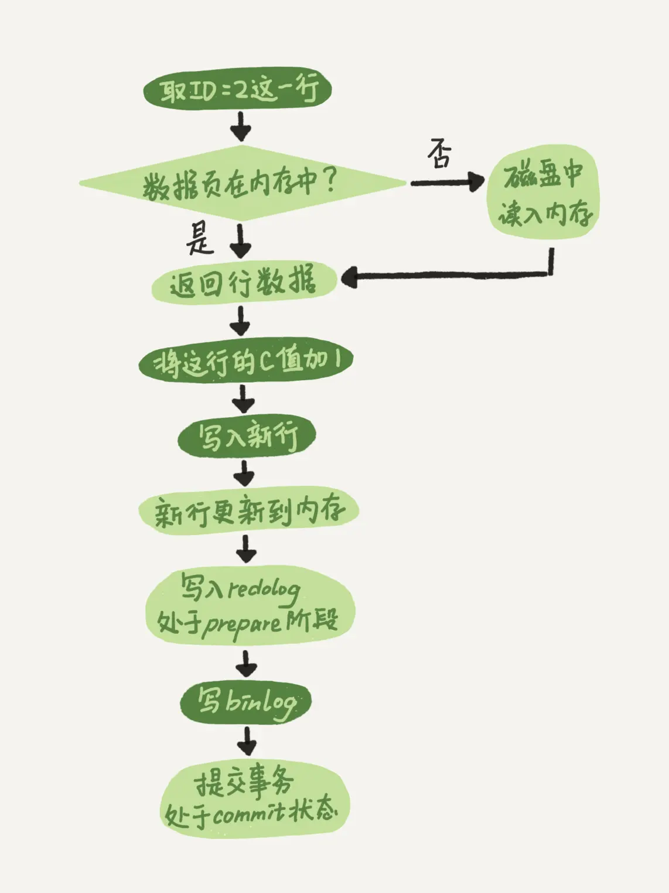

# SQL更新语句的执行

更新流程射击两个重要日志模块：```redo log```（重做日志） 和 ```binlog```（归档日志）
## 为何有两种日志？
> 因为最开始MySQL没有```InnoDB引擎```，自带引擎是 ```MyISAM```，而```MyISAM```没有```crash-safe```的能力，```binlog```只能用于归档。```InnoDB引擎```是另一家公司以插件形式引入MySQL的
> 
## 两种日志有以下不同
1. redo log是InnoDB引擎特有的；binlog是MySQL的Server层实现，所有引擎都可以使用
2. redo log是物理日志，记录的是“在某个页面做了什么修改”；binlog是逻辑日志，记录的是这个语句的原始逻辑，比如“给ID=2这一行的c字段加1”
3. redo log是循环写的，空间固定会用完；binlog是追加写的（binlog文件写到一定大小后会切换到下一个写入）


## *redo log*

Write-Ahead Logging，先写日志，再写磁盘。当更新时，InnoDB引擎会先把记录写到```redo log```，并更新内存，此时就算更新完成。InnoDB引擎会在适当的时候，把这个操作记录更新到磁盘。
    
InnoDB的```redo log```大小是固定的，可以配置。类似于循环链表，上有```write pos```和```checkpoint```。

```write pos```是当前记录的位置，边写边后移。```checkpoint```是当前要擦除的位置，擦除记录前要先把记录更新到数据文件（即磁盘文件）中。

> 记录落盘可以通过```innodb_flush_log_at_trx_commit```参数控制
>> * 当设置为1的时候，事务每次提交都会将log buffer中的日志写入os buffer并调用fsync()刷到log file on disk中。这种方式即使系统崩溃也不会丢失任何数据，但是因为每次提交都写入磁盘，IO的性能较差。
>> * 当设置为0的时候，事务提交时不会将log buffer中日志写入到os buffer，而是每秒写入os buffer并调用fsync()写入到log file on disk中。也就是说设置为0时是(大约)每秒刷新写入到磁盘中的，当系统崩溃，会丢失1秒钟的数据。
>> * 当设置为2的时候，每次提交都仅写入到os buffer，然后是每秒调用fsync()将os buffer中的日志写入到log file on disk。

> ```crash-safe```
>> 有了```redo log```，InnoDB引擎可以保证即使数据库发生异常，之前提交的记录也都不会丢失，这个能力称为 ```crash-safe```

## *binlog*

MySQL有Server层和引擎层。binlog 是 Server 层的日志，redo log是引擎层面的日志。

## 执行流程

1. 执行器用引擎找到 ID = 2 这一行数据，ID是主键，引擎直接用树搜索找到这一行。如果 ID = 2 这一行的数据页在内存中，则直接返回给执行器，否则从磁盘读入内存再返回。
2. 执行器拿到引擎给的行数据，执行+1操作，得到新的一行数据，再调用引擎提供的接口写入这一行数据
3. 引擎将这一行新数据写入内存，同时将记录写入 redo log 里面，此时 redo log 处于 prepare 状态。然后告知执行器执行完成了，随时可以提交事务。
4. 执行器生成这一步的 binlog，并把 binlog 写入磁盘
5. 执行器调用引擎的事务提交接口，引擎把刚刚写入的 redo log 状态改为 commit，更新完成
    > 如果此时 prepare 写入成功，binlog写入后crash，mysql启动时会自动commit这个事务；如果 prepare 写入成功，binlog写入失败，此时发生crash，mysql会自动回滚事务

> update流程图，浅色代表引擎执行，深色代表执行器执行
> 
<p style="text-align: center;">执行update语句的流程</p>

## 两阶段提交

redo log 的写入拆成了两个步骤：prepare 和 commit，这就是```两阶段提交```

这是为了保证两份日志之间的逻辑一致

redo log 和 binlog 具有关联行，在恢复数据时，redo log 用于恢复主机故障时的未更新的物理数据，binlog 用于备份操作。每个阶段的log操作都是记录在磁盘的，在恢复数据时，redo log 状态为 commit 则说明 binlog 也成功，直接恢复数据；如果 redo log 是 prepare，则需要查询对应的 binlog 事务是否成功，决定是回滚还是执行，binlog 成功则执行，否则回滚。

真正的“两阶段提交” 是指对 redo log 进行“两阶段提交”：先 prepare，再commit。 数据库 crash-重启后，会对记录对redo log 进行check： 1、如果 redo log 已经commit，则视为有效。 2、如果 redo log prepare 但未commit，则check对应的bin log记录是否记录成功。 2.1、bin log记录成功则将该prepare状态的redo log视为有效 2.2、bin log记录不成功则将该prepare状态的redo log视为无效

> 如果不使用两阶段提交，假设更新 ID = 2 行的 c 字段从0到1
> - 先写 redo log 再写 binlog。
>> 假设在 redo log 写完，binlog 未写完时 MySQL 异常重启。此时恢复数据，使用 redo log 会让 c 恢复为1。但是此时 binlog 未记录，如果使用 binlog 来恢复临时库时，恢复出来的 c 这一行就是0，不一致。
> - 先写 binlog 再写 binlog。
>> 我如果在binlog写完后 crash，由于 redo log 还没写，崩溃恢复后这个事务无效，c 还是0。但是由于 binlog 记录了更新 c 为 1 的操作，此时恢复出来的数据多了一个事务，与原库的值不一致。

## 参数

```innodb_flush_log_at_trx_commit```