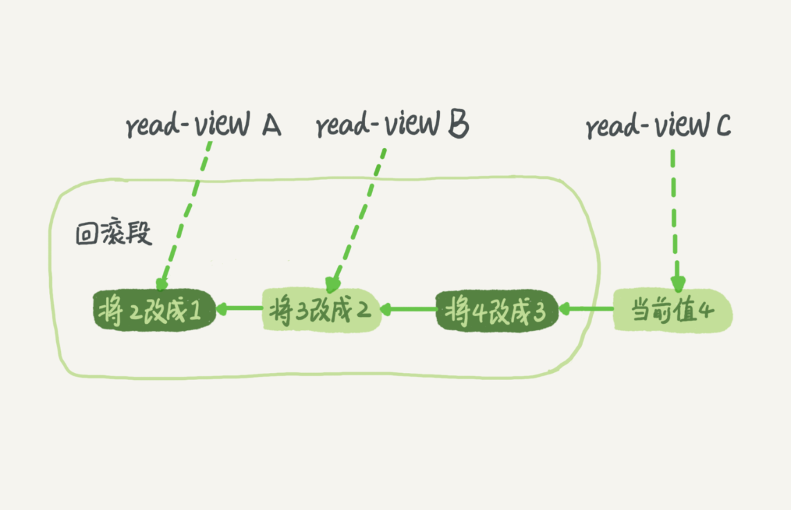

# 事务隔离

## *ACID*

Atomicity（原子性），Consistency（一致性），Isolation（隔离性），Durability（持久性）

* Atomicity（原子性）：一个事务（transaction）中的所有操作，或者全部完成，或者全部不完成，不会结束在中间某个环节。事务在执行过程中发生错误，会被回滚（Rollback）到事务开始前的状态，就像这个事务从来没有执行过一样。即，事务不可分割、不可约简。
* Consistency（一致性）：在事务开始之前和事务结束以后，数据库的完整性没有被破坏。这表示写入的资料必须完全符合所有的预设约束、触发器、级联回滚等。 
* Isolation（隔离性）：数据库允许多个并发事务同时对其数据进行读写和修改的能力，隔离性可以防止多个事务并发执行时由于交叉执行而导致数据的不一致。事务隔离分为不同级别，包括未提交读（Read uncommitted）、提交读（read committed）、可重复读（repeatable read）和串行化（Serializable）。
* Durability（持久性）：事务处理结束后，对数据的修改就是永久的，即便系统故障也不会丢失。

## 隔离级别

读未提交（read uncommitted）、读提交（read committed）、可重复读（repeatable read）和串行化（serializable ）

* 读未提交（read uncommitted）。一个事务还没提交时，它做的变更就能被别的事务看到。
* 读提交（read committed）。一个事务提交之后，它做的变更才会被其他事务看到。
* 可重复读（repeatable read）。一个事务执行过程中看到的数据，总是跟这个事务在启动时看到的数据是一致的。
* 串行化（serializable）。顾名思义是对于同一行记录，“写”会加“写锁”，“读”会加“读锁”。当出现读写锁冲突的时候，后访问的事务必须等前一个事务执行完成，才能继续执行。

> <div style="width: 75%;margin: 0 auto"></div>
> 
> * 若隔离级别是“读未提交”， 则 V1 的值就是 2。这时候事务 B 虽然还没有提交，但是结果已经被 A 看到了。因此，V2、V3 也都是 2。
> * 若隔离级别是“读提交”，则 V1 是 1，V2 的值是 2。事务 B 的更新在提交后才能被 A 看到。所以， V3 的值也是 2。
> * 若隔离级别是“可重复读”，则 V1、V2 是 1，V3 是 2。之所以 V2 还是 1，遵循的就是这个要求：事务在执行期间看到的数据前后必须是一致的。
> * 若隔离级别是“串行化”，则在事务 B 执行“将 1 改成 2”的时候，会被锁住。直到事务 A 提交后，事务 B 才可以继续执行。所以从 A 的角度看， V1、V2 值是 1，V3 的值是 2。

## 事务隔离的实现

```MVCC```（Multi-Version Concurrency Control）多版本并发控制

在MySQL中，每次更新的操作会记录一条回滚操作（undo log）。记录上最新的值，可以通过回滚操作，得到前一个状态的值。

> 假设一个值从 1 更新到了2、3、4，在 undo log 会有如下记录
> <div style="width: 75%;margin: 0 auto"></div>
> 同一条记录在数据库中存在多个版本，就是数据库的MVCC

没有事务需要用到这些 undo log 时，undo log 才会删除。系统中没有比这个 undo log 更早的 read-view 时，则就是不需要了。

长事务意味着系统会存在很老的事务视图，因此在它提交之前，回滚记录都要保留，会占用大量的存储空间。在MySQL5.5及之前的版本，undo log 和数据字典一起放在 ibdata 文件里，即使长事务最终被提交，回滚段被清理，文件也不会变小。也因此，尽量不使用长事务

## 事务启动方式

* 显式启动，```begin``` 或者 ```start transaction```。配套提交语句是 ```commit```，回滚语句是 ```rollback```
* ```set autocommit = 0```，这个命令会把这个线程的自动提交关闭。只要开始执行语句，事务就开始启动，直到 ```commit``` 或者 ```rollback```，或者断开连接。
* 对于一个事务结束后开启第二个事务，可以使用 ```commit work and chain```，来提交第一个事务，开启第二个事务（可以不用写第二个事务的 ```begin```）。这样可以省去再次执行 ```begin``` 的开销。

可以在 information_schema.innodb_trx 表中查询长事务
```sql
select *
from information_schema.innodb_trx
where TIME_TO_SEC(timediff(now(),trx_started))>60
```

# 问题：如何避免长事务对业务的影响

* 对应用端来说
1. 确认 autocommit 参数值，设置为1
2. 确认是否有不必要的事务，有的框架会将语句用 begin/commit 框起来，即使是只有 select 语句也放入事务中，这种可以去掉
3. 业务连接数据库，可以根据业务的估值，通过 set max_excution_time 设置最长的执行时间

* 对数据库来说
1. 监控 information_schema.Innodb_trx 表，设置长事务阈值，超时就报警或者 kill
2. Percona 的 pt-kill 工具
3. 在业务测试阶段要求输出所有的 general_log ，分析日志行为提前发现问题
4. 对于 MySQL 5.6 或更高版本，可以设置 ```innodb_undo_tablespaces``` 设置成 2（或更大的值）。如果真的出现啊大事务导致回滚段过大，这样设置后续清理方便。这个参数是用于控制 undo 是否开启独立的表空间参数：为 0 表示 undo 使用系统表空间，即 ibdata1；不为 0 表示使用独立表空间，名称为 undo001 undo002，存放地址配置参数为 ```innodb_undo_directory```。一般 ```innodb_undo_tablespaces``` 默认配置为0，```innodb_undo_directory``` 默认配置为当前数据目录。