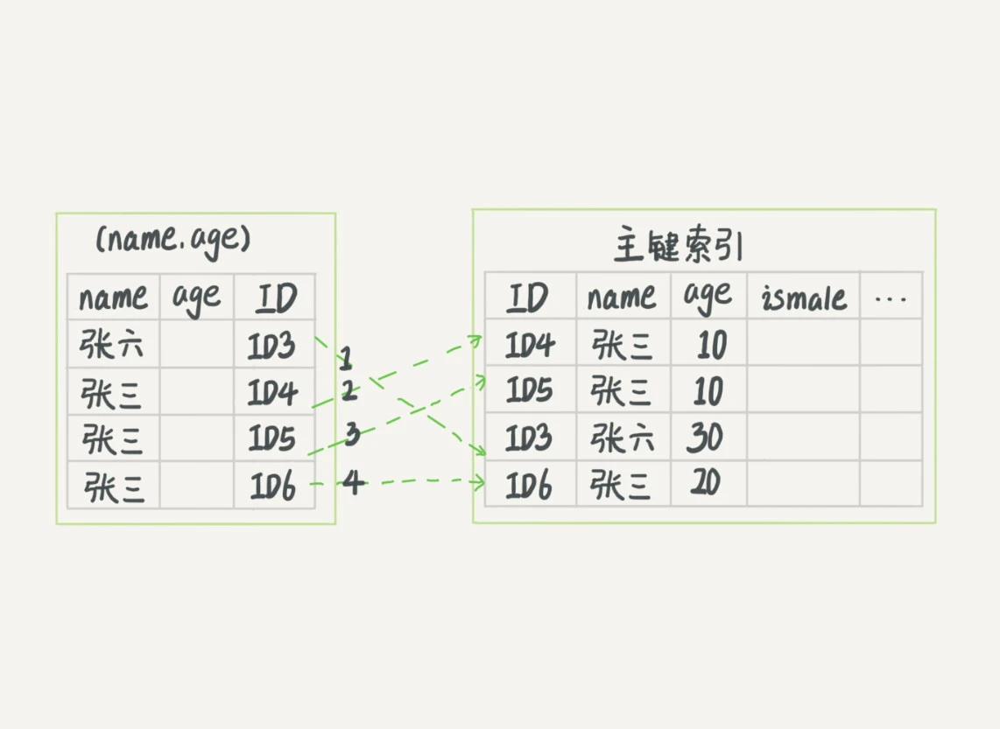
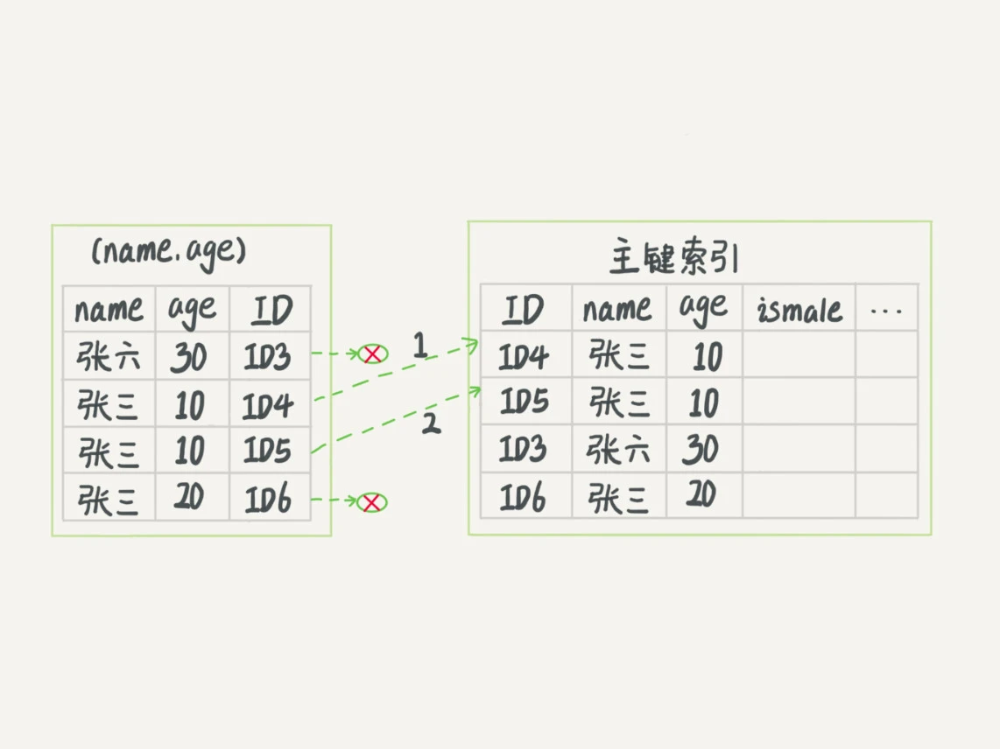

# 索引

用于提高查询数据的效率

## 索引的常见模型

常见的有哈希表、有序数组、搜索树等
> 哈希表适用于 **只有等值查询** 的情况，比如 ```Memcached``` 及其他一些 NoSQL 引擎 
> 
> 有序数组在 **等值查询** 和 **范围查询** 场景的性能都非常优秀。但对于插入的操作，要使插入记录后面的所有记录都挪动位置，成本太高。因此，<span class="font-strong">有序数组索引只适用于静态存储引擎</span>。
> 
> MySQL使用B+树（N叉树）。MySql默认一个节点的长度为16K，一个整数（bigint）字段索引的长度为 8B,另外每个索引还跟着6B的指向其子树的指针；所以16K/14B ≈ 1170

索引由存储引擎实现。即使同一种类型的索引，在不同存储引擎的实现也可能不同。

> MyISAM和InnoDB两个存储引擎的索引实现方式都是基于B+树，但是两者的实现不同。 
> * MyISAM：叶节点的data域存放的是数据记录的地址。因此，MyISAM中索引检索的算法为首先按照B+Tree搜索算法搜索索引，如果指定的Key存在，则取出其data域的值，然后以data域的值为地址，读取相应数据记录。MyISAM的索引方式也叫做“非聚集”的。MyISAM的辅助索引（Secondary key）在结构上没有任何区别，只是主索引要求key是唯一的，而辅助索引的key可以重复。
>
> * InnoDB：InnoDB的数据文件本身就是索引文件。这棵树的叶节点data域保存了完整的数据记录。InnoDB的辅助索引data域存储相应记录主键的值而不是地址。换句话说，InnoDB的所有辅助索引都引用主键作为data域。

## InnoDB 的索引模型

InnoDB 中，表都是根据主键顺序以索引的方式存放的，这种存储方式的表称为索引组织表。索引是 B+ 树，数据都存在 B+ 树中。

每个索引在 InnoDB 里对应一棵 B+ 树

假设有一表 T
```sql
mysql> create table T(
id int primary key, 
k int not null, 
name varchar(16),
index (k))engine=InnoDB;
insert into T (id,k) values(100,1),(200,2),(300,3),(500,5),(600,6);
```

<div style="width: 75%;margin: 0 auto">
    
    <div class="text-center">InnoDB的索引组织结构</div>
</div>

根据叶子节点的内容，可以分为主键索引和非主键索引。

* 主键索引的叶子节点存的是整行数据。在 InnoDB 里，也被称为 ```聚簇索引```（clustered index）
* 非主键索引的叶子节点存的是主键的值。在 InnoDB 里，也被称为 ```二级索引```（secondary index）

> 基于主键索引和普通索引的查询有什么区别？
>> 如果语句是 select * from T where ID=500，即主键查询方式，则只需要搜索 ID 这棵 B+ 树
>
>> 如果语句是 select * from T where k=5，即普通索引查询方式，则需要先搜索 k 索引树，得到 ID 的值为 500，再到 ID 索引树搜索一次。回到主键索引树搜索的过程，称为```回表```。也就是说，基于非主键索引的查询需要多扫描一棵索引树。
> 
> 因此，我们在应用中应该尽量使用主键查询。

## 索引的维护

B+ 树为了维护索引的有序性，新插入值的时候有必要做维护。对于上面的数据，如果新增一条 ID = 700 的值，则只需在 R5 后插入即可；若新增 ID = 400 的值，则需在 R3 R4 之间插入，再挪动之后数据的位置，若该页数据已满，则需页分裂：申请新的数据页，挪动部分数据过去。此时性能会受到影响，同时空间利用率也会下降。

对于自增数据插入数据模式来说，更符合上面提到的递增插入。每次插入新纪录都是追加操作，不涉及其他节点的挪动，也不会触发叶子节点的分裂。写数据的性能比较好。

除了性能的角度，从储存空间的角度来看，如果一张表包含用户身份证号，那么用自增主键比用身份证号作为主键相比：身份证号做主键，二级索引叶子几点约占用20字节，如果用整型做主键，则只需4个字节。

显然，主键长度越小，普通索引的叶子节点也越小，普通索引占用的空间也越小

所以，从性能和存储空间考虑，使用自增主键往往是更合理的选择

> 索引可能会因为删除，或者页分裂等原因，会有数据空洞的存在，重建索引的过程会将数据按顺序插入，这样页面的利用率高
>
> 重建索引 drop -> create 是没有问题的。 重建主键索引 不能用drop->create, 不论是删除主键还是创建主键，都会将整个表重建。所以连着执行这两个语句的话，第一个语句就白做了。这两个语句，你可以用这个语句代替 ： 
> 
> alter table T engine=InnoDB
> 
> 这个语句在innobDB里会触发mysql重建该表，并进行碎片处理

## 覆盖索引

如果执行 select ID from T where k between 3 and 5，这时只需要查 ID 的值，而 ID 的值已经在 k 的索引树上了，因此可以直接提供查询结果，不需要回表。即在这个查询里，索引 k 已经“覆盖了”我们的查询需要，我们称之为 ```覆盖索引```

<span class="font-strong">由于使用覆盖索引可以减少树的搜索次数，显著提升查询性能，所以使用覆盖索引是一个常用的性能优化手段。</span>

> 假如有一个市民表，是否需要将身份证号和姓名建立联合索引

```sql
CREATE TABLE `tuser` (
`id` int(11) NOT NULL,
`id_card` varchar(32) DEFAULT NULL,
`name` varchar(32) DEFAULT NULL,
`age` int(11) DEFAULT NULL,
`ismale` tinyint(1) DEFAULT NULL,
PRIMARY KEY (`id`),
KEY `id_card` (`id_card`),
KEY `name_age` (`name`,`age`)
) ENGINE=InnoDB
```
身份证号是该表的唯一标识，那么如果有根据身份证号查询市民信息的需求，建立身份证号的索引就可以了。还是否需要建立（身份证号，姓名）的联合索引呢，这是不是在浪费空间？

如果我们有根据身份证号查姓名的高频请求，那么这个联合索引就有意义了。它可以在这个高频请求上使用覆盖索引，不需要回表查询这一列的记录，减少语句执行时间。<span class="font-strong">这也是覆盖索引的第二个使用：在联合索引上使用，避免回表。</span>
===
## 最左前缀原则

B+ 树这种索引结构，可以使用索引的“最左前缀”，来定位记录。
<div style="width: 75%;margin: 0 auto">
    
</div>
<span class="font-strong">这个最左前缀可以是联合索引的最左 N 个字段，也可以是字符串索引的最左 M 个字符。</span>

基于上述说明，建立联合索引的时候，需要注意索引内字段的顺序。如果已有联合索引 (a, b) 那么一般不用单独在 a 上单独建立索引了。
* 也即，如果通过 **调整联合索引的顺序可以少维护一个索引，那么这个索引是优先考虑的。**
* 其次，如果既有联合查询，又有针对 a b 的单独查询，那么就需要维护针对 (a, b) (b) 两个索引了，这时候需要 **考虑的原则就是空间了。**

## 索引下推

用上述 tuser 表，有如下查询，以及索引 (name, age)
```sql
select * from tuser where name like '张%' and age = 10 and ismale = 1;
```
因为前缀索引在查询的时候，会先找到索引树中满足“张%”的记录。然后
* 在 MySQL 5.6 之前，只能从满足满足条件的索引开始一个个回表，找到主键索引上的数据行，再对比对应的记录是否满足剩下条件
* 在 MySQL 5.6 引入的 ```索引下推（index condition pushdown）``` ，可以在索引遍历过程中，对索引中包含的字段先做判断，直接过滤掉不满足条件的记录，减少回表次数。

<div style="width: 75%;margin: 0 auto">
    
    <div class="text-center">无索引下推执行流程</div>
</div>
<br/>
<div style="width: 75%;margin: 0 auto">
    
    <div class="text-center">索引下推执行流程</div>
</div>

## 问题

有表
```sql
CREATE TABLE `geek` (
  `a` int(11) NOT NULL,
  `b` int(11) NOT NULL,
  `c` int(11) NOT NULL,
  `d` int(11) NOT NULL,
  PRIMARY KEY (`a`,`b`),
  KEY `c` (`c`),
  KEY `ca` (`c`,`a`),
  KEY `cb` (`c`,`b`)
) ENGINE=InnoDB;
```
存在查询
```sql
select * from geek where c=N order by a limit 1;
select * from geek where c=N order by b limit 1;
```
两个联合索引 ca cb 是否都需要？

> 对于二级索引C，会默认和主键做联合索引。所以索引c的排序为cab，索引cb的排序顺序为cba。所以，结论是 ca 可以去掉，cb 需要保留。

<link rel="stylesheet" type="text/css" href="../../style.css" >