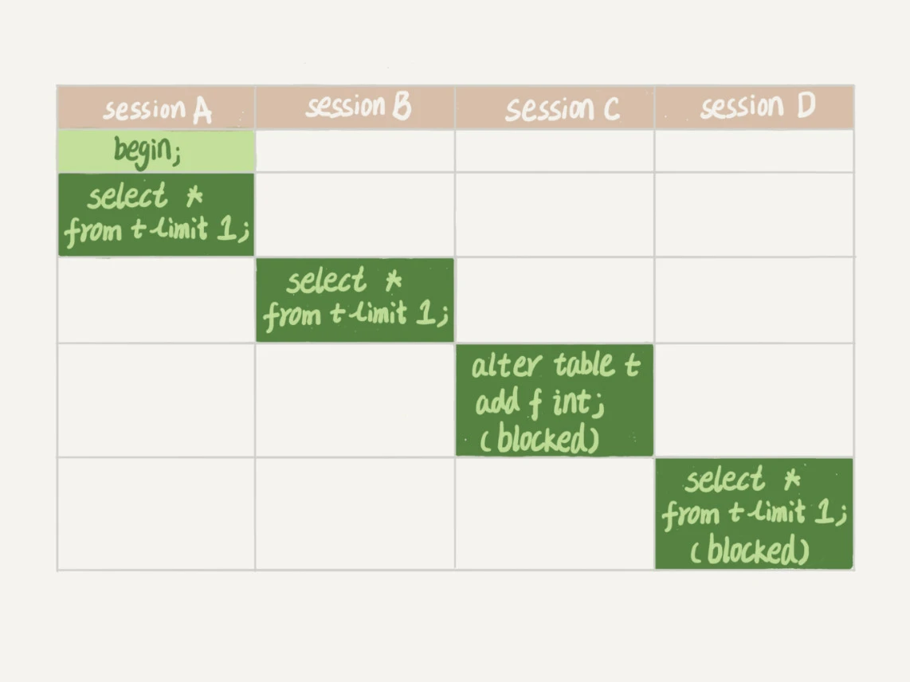

# 锁

MySQL 里面的锁大致可以分为全局锁、表级锁和行锁三类。

## 全局锁

全局锁就是对整个数据库实例加锁。MySQL 提供了一个加全局锁的方法，命令是 ```Flush tables with read lock (FTWRL)```。当你要整个数据库处于只读状态时，可以用这个命令。之后其他线程的以下语句会被阻塞：数据更新语句（数据的增删改）、数据定义语句（包括建表和表结构变更等）和更新类的事务提交语句。使用 ```unlock tables``` 解锁

典型应用场景就是全局逻辑备份。但是这样子让整个数据库处于只读状态
* 如果在主库上备份，那么备份期间不能执行更新，业务无法进行
* 如果在从库上备份，那么备份期间从库不能执行从主库同步过来的 binlog，会导致主从延迟（尤其是读写分离中负责 read 的从库，binlog 不能停止且要保持实时性）

因此，备份可以在开启 RR 隔离级别的事务中进行。官方自带的逻辑备份工具 mysqldump 可以使用 single-transaction 来启动事务，拿到一致性视图。由于 MVCC ，其他事务的更新不受影响。

但是事务下的备份，需要存储引擎的支持，MyISAM 不支持事务，因此它需要 FTWRL 来备份。

> 也有 set global readonly = true 的方式让全库进入只读状态，和 FTWRL 相比
> * 有些系统中，readonly 的值会用来做其他逻辑，比如用判断一个库是主库还是备库
> * 在异常处理的机制上，如果执行 FTWRL 命令后，客户端发生异常断开连接，MySQL 会自动释放这个全局锁，整个库回到可以更新的状态。使用readonly ，如果客户端异常，数据库会一致保持 readonly 状态，会让数据库长期保持只读，风险较高

## 表级锁

MySQL 的表级锁有两种：一种是表锁，一种是元数据锁（```meat data lock，MDL```）

### 表锁

**表锁的语法是 lock tables ... read/write。与 FTWRL 类似，可以用unlock tables 主动解锁，也可以在客户端断开连接时自动释放。需要注意的时，lock tables 语法出了会限制其他线程的读写外，也限定了本线程接下来的操作对象。**

例如，执行 lock tables t1 read, t2 write; 则其他线程读 t1 读写 t2 的语句都会被阻塞。同时，该线程也只能读 t1，写 t2 ( ```MySQL 5.6.42``` )。同时不能访问其他表

> 对于支持行锁的 InnoDB 引擎来说，一般不使用 lock tables 命令来控制并发。

### MDL

元数据锁是server层的锁，表级锁，主要用于隔离 DML（Data Manipulation Language，数据操纵语言，如select）和 DDL（Data Definition Language，数据定义语言，如改表头新增一列）操作之间的干扰。每执行一条DML、DDL语句时都会申请 MDL 锁，DML 操作需要 MDL 读锁，DDL 操作需要 MDL 写锁（MDL加锁过程是系统自动控制，无法直接干预，读读共享，读写互斥，写写互斥）

MDL 不需要显式使用，在访问表的时候会自动加上。MDL 的作用是保证读写的正确性。防止例如读时，另一线程修改表结构。

在 MySQL 5.5 版本中引入了 MDL，当对一个表做增删改查操作时，加 MDL 读锁；当对表做结构变更时，加 MDL 写锁。
* 读锁之间不互斥，因此可以有多个线程同时对一张表增删改查
* 读写锁之间，写锁之间是互斥的，用来保证变更表结构操作的安全性。

> 在 MySQL 5.6 中，按 ABCD 启动执行如下语句。
> <div style="width: 75%; margin: 0 auto">
>    
> </div>
> sessionA 启动拿到 t 的 MDL 读锁。sessionB 启动，读锁不互斥，可以正常执行。sessionC 启动，需要拿到 MDL 写锁，因为 sessionA 的 读锁还没有释放，sessionC 被 block。而 MDL 锁的申请是在队列中，因此后面的 sessionD 的 MDL 读锁也被 block。这时如果客户端频繁重试的话，会不停建立连接，消耗完这个库的线程。


### Online DDL
由于 DDL 锁表会严重影响性能，不锁又无法阻止 DML 的影响。于是 MySQL 推出了 online ddl，通过一下五步执行
* 拿 MDL 写锁（确保没有其他 DDL 在执行）
* 降级成 MDL 读锁
* 真正开始 DDL（另辟空间开始改表结构、填充数据）
* 升级成 MDL 写锁（拿到后，替代原始表）
* 释放 MDL 写锁

为了防止出现这种情况，首先要解决长事务，它们可能会占用 MDL 锁。可以等待事务执行完成，或者 kill 掉这个长事务。

如果这个表的连接很频繁，这时候 kill 可能来不及，可以在语句中设定等待时间。MariaDB 和 AliSQL 都支持 NOWAIT/WAIT N 的语法设置超时时间。

> session A: begin; select * from t limit 1; 最先启动sessionA<br>
session B: begin; select * from t limit 1; 紧接着启动sessionB<br>
session C: alter table t add f int; 然后再是启动sessionC<br>
session D: begin; select * from t limit 1; 最后是启动sessionD<br>
> session A和B正常启动，然后session C被block，之后session D也被block。当把 session A 和 session B 都commit掉后，发现session C依然是block的（被 session D阻塞），只有当把 session D 也commit掉后，session C才执行下去。
> 
> 上图中session A、B commit后，sessionC 确实拿到了写锁，只不过由于锁降级，令sessionD拿到了读锁。但session D没有commit，因此session C在执行online commit到第三步后，又给阻塞了。所以就出现了类似于“插队”的现象。

### 问题

备份一般都会在备库上执行，在用–single-transaction 方法做逻辑备份的过程中，如果主库上的一个小表做了一个 DDL，比如给一个表上加了一列。这时候，从备库上会看到什么现象呢？

```sql
Q1:SET SESSION TRANSACTION ISOLATION LEVEL REPEATABLE READ;
Q2:START TRANSACTION  WITH CONSISTENT SNAPSHOT；
/* other tables */
Q3:SAVEPOINT sp;
/* 时刻 1 */
Q4:show create table `t1`;
/* 时刻 2 */
Q5:SELECT * FROM `t1`;
/* 时刻 3 */
Q6:ROLLBACK TO SAVEPOINT sp;
/* 时刻 4 */
/* other tables */
```
1. 如果 在Q4 之前到达：没有影响，备份的是 DDL 之后的表结构
2. 如果在 ***时刻2*** 之前到达，表结构被改过，Q5 执行的时候，报 Table Definition has changed, please retry transaction，现象：mysqldump 终止
3. 如果在 ***时刻2*** 和 ***时刻3*** 之间到达，mysqldump 占据着 t1 的 MDL 读锁，binlog 被阻塞，现象：主从延迟，直到 Q6 执行完成
4. 从 ***时刻4*** 开始，mysql 释放了 MDL 读锁，现象：没有影响，备份拿到的是 DDL 前的表结构


<link rel="stylesheet" type="text/css" href="../../style.css" >