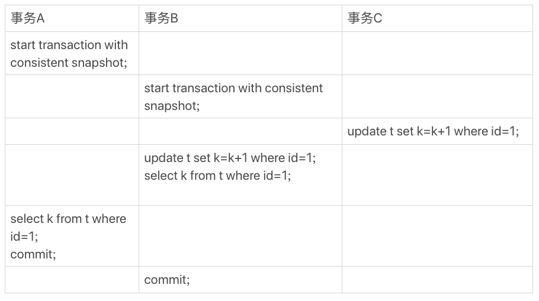

# 事务

在 RR 的隔离级别下，事务 T 启动会创建一个视图 read-view ，之后事务 T 的执行期间，即使有其他事务修改了数据，事务 T 读取到的值仍和启动时一样。

而当一个事务要更新一行数据时，如果这一行数据被锁住了，进入等待状态，那么当这个事务后续获取到行锁时，它读取到的值是什么呢。

有如下表 t

```sql
CREATE TABLE `t` (
  `id` int(11) NOT NULL,
  `k` int(11) DEFAULT NULL,
  PRIMARY KEY (`id`)
) ENGINE=InnoDB;
insert into t(id, k) values(1,1),(2,2);
```
以及事务 ABC，autocommit = 1
<div>
  
  <div class="text-center">图 1</div>
</div>

> 要注意，begin/start transaction 并不是事务的起点，在执行到他们之后的第一个操作 InnoDB 表语句时，事务才真正启动。如果想立即启动事务，可以使用 start transaction with consistent snapshot 这个命令
>> 第一个启动方式，一致性视图在执行第一个快照度语句时创建<br/>
>> 第二个启动方式，一致性视图在执行 start transaction with consistent snapshot 时创建

事务 B 查询到的值是 3，事务 A 查询到的值是 1。

> 在 MySQL 里，有两个 “视图” 的概念
> * 一个是 view。它是一个查询语句定义的虚拟表，在调用的时候执行查询语句并生成结果。创建语法是 create view ... ，它的查询方法和表一样
> * 一个是 InnoDB 在执行 MVCC 用到的一致性视图，即 ```consistent read view``` ，用来支持 RC（Read Committed） 和 RR（Repeatable Read） 隔离级别的实现。
> 
> 他们没有物理结构，只是用来定义“我能看到什么数据”

--------------

## “快照” 在 MVCC 里是怎么工作的

在 RR 的隔离级别下，事务启动时就 “拍了个快照”，这个快照是基于整库的。

InnoDB 的每个事务都由一个唯一的事务 ID，叫做 transaction ID。它是事务开始时向 InnoDB 的事务系统申请的，是按申请顺序严格递增。

每行数据也是有多个版本。每次事务更新的时候，都会生成一个新的数据版本，并把 transaction ID 赋值给这个版本的事务 ID，记为 row trx_id。以及 roll_ptr 回滚指针执行 undo log 记录。

<div>
    
    <div class="text-center">图 2 数据行多版本</div>
</div>
图中是同一行数据的 4 个版本，当前最新版本是 V4 ，被 transaction ID = 25 的事务更新。

undo log 即是图中的虚线部分。V1、V2、V3 不是真实存在，如果需要 V2 的数据，需要从 V4 依次执行 U3 U2 得到。

我们知道 RR 隔离级别下，其他事务的更新对当前事务都不可见。<span class="success-color">因此，一个事务启动时声明说，“以我启动时为准，如果一个数据版本是我启动之前生成的，认可；如果是我启动之后生成的，不认可，直到找到它的上一个可见版本”</span>

在实现上，InnoDB 为每个事务构造了一个数组，用来保存这个事务启动的瞬间，正在 “活跃” 的所有事务 ID。“活跃”指的是事务启动了还未提交。

数组里面事务 ID 的最小值记为低水位（```up_limit_id```），当前系统已经创建过的事务 ID 最大值加 1 为高水位（```low_limit_id```）。

<span class="success-color">这个视图数组和高水位，就组成了当前事务的一致性视图（read-view）。而数据版本的可见性，就是基于数据的 row trx_id 和这个一致性视图的对比结果得到。</span>

这个视图数组把所有的 row trx_id 分为了几种不同的情况。
<div>
    
    <div class="text-center">图 3 数据版本可见规则</div>
</div>

对于一个事务的启动瞬间来说，一个数据版本的 row trx_id，有以下几种情况
1. 如果落在绿色部分，表示这个版本是已提交的事务或者是当前事务自己生成的，这个数据是可见的
2. 如果落在红色部分，表示这个版本是由将来启动的事务生成的，是肯定不可见的
3. 如果落在黄色部分，包括两种情况
    * 若 row trx_id 在数组中，表示生成这个数据版本的事务还未提交，不可见   
    * 若 row trx_id 不在数组中，表示生成这个数据版本的事务已提交，可见

对图 2 的数据来说，若一个事务的低水位是 18，那么当他访问这一行时，就会由 V4 通过 U3 计算出 V3，在它看来，这一行数据是 11。

<span class="success-color">InnoDB 利用 “所有数据都有多个版本” 的这个特性，实现了 “秒级创建快照” 的能力。</span>

对于图 1，假设：
1. 事务 A 启动之前，系统只有一个 ID 为 99 的事务活跃
2. 事务 A、B、C 的版本号分别是 100、101、102，且当前系统只有这 4 个事务
3. 三个事务开始前，(1, 1) 这一行数据的 row trx_id 是 90

<div>
    
    <div class="text-center">图 4 事务 A 查询数据逻辑图</div>
</div>

图中可以看出，第一个有效更新是事务 C，数据版本变成了 102。第二个更新是事务 B，把数据版本更新成了 101，102 成了历史版本。这是事务 A 来查询，但事务 B 还未提交，结果是不可见的，否则就是脏读了。事务 A 的视图数组是 [99, 100]，从当前版本开始读起：
* 发现 (1,3)，数据版本 row trx_id = 101，比高水位大，处于红色区域，不可见
* 发现 (1,2)，数据版本 row trx_id = 102，比高水位大，处于红色区域，不可见
* 发现 (1,1)，数据版本 row trx_id = 90，比低水位小，处于绿色区域，不可见

<span class="success-color">这样执行下来，虽然期间这一行数据被修改过，但事务 A 无论在什么时候查询，看到的数据结果都是一致的，所以我们称之为一致性读。</span>

可见，一个数据版本，对于一个事务视图来说，除了自己更新的都是可见外，有三种情况
* 版本未提交，不可见
* 版本已提交，但是是在事务创建后提交的，不可见
* 版本已提交，且是在事务创建之前提交的，可见

-----------

## 更新逻辑

对于事务 B，按照一致性读，结果貌似不正确。

如果事务 B 在更新前查询 k，那么结果确实是 1。<span class="success-color">但是更新的时候，就不能在历史版本上更新了，否则事务 C 的更新就丢失了。因此，事务 B 此时的 set k = k + 1 是在 (1,2) 的基础上进行的操作。</span>

这里用到了一个规则：更新数据都是先读后写，<span class="success-color">这个读只能读当前的值，称为 ```当前读```</span>。更新后，数据版本的 row trx_id 是 101。

对于 select 语句，如果加了锁（```lock in share mode``` 或 ```for update```），也是当前读。

所以，如果把事务 A 的 select * from t where id = 1 修改下，加上 ```lock in share mode``` 或 ```for update```，也都可以读到版本号是 101 的数据，返回 k 值是3。
```sql
select k from t where id = 1 lock in share mode; -- 加了读锁（S锁，共享锁）
select k from t where id = 1 for update; -- 加了写锁（X锁，排他锁）
```

假如再进一步，事务 C 换成了 C'
<div>
    
    <div class="text-center">图 5 事务 A、B、C' 的执行流程</div>
</div>

事务 C' 不同的是，更新后没有立马提交。在它提交前，事务 B 先更新了。虽然事务 C' 还没提交，但是由于 两阶段锁协议，这一行数据的写锁还未释放，事务 B 更新是当前读，要获加锁，它的更新会被 block，必须等到事务 C' 释放这个锁，才可以继续他的当前读

<div>
    
    <div class="text-center">图 6 事务 B、C' 的更新逻辑图</div>
</div>

可重读读的核心就是一致性读（consistent read）；事务更新数据时，只能用当前读。如果当前记录的行锁被占用，就要进入锁等待。

读提交和可重复读的逻辑类似，他们的区别主要是：
* RR 隔离级别下，是需要再事务开始时创建一致性视图，之后事务里的其他查询都共用这个视图
* RC 隔离级别下，每个语句执行前都会重新算出一个视图

> 对于 RC 隔离级别，“start transaction with consistent snapshot” 语句就等效于普通的 “start transaction”

如果是 RC 隔离级别下，事务 A 和事务 B 的查询语句查到的 k，分别是多少呢？

下图是 RC 级别下的状态图，可以看到两个查询语句创建视图的时机发生了变化。
<div>
    
    <div class="text-center">图 7 RC 隔离级别下事务状态图</div>
</div>

事务 A 的视图在查询时创建，这个时机 (1,2) (1,3) 的生成时间都在创建这个视图之前。但是这个时刻：
* (1,3) 还没提交，属于情况 1，不可见
* (1,2) 已经提交了，属于情况 3，可见

因此事务 A 查询 k = 2，事务 B 查询 k = 3

-----

## 问题

现在假如有下表，事务隔离级别是 RR。现在要把所有 id 和 c 相等的数据 c 清零，但却发现 0 rows affected，试图构造这种情况。

```sql
mysql> CREATE TABLE `t` (
  `id` int(11) NOT NULL,
  `c` int(11) DEFAULT NULL,
  PRIMARY KEY (`id`)
) ENGINE=InnoDB;
insert into t(id, c) values(1,1),(2,2),(3,3),(4,4);
```
> 可以启动两个事务，一个事务在另一个事务之前把 c 值都修改了。由于更新是当前读，会导致这种情况。

<link rel="stylesheet" type="text/css" href="../../style.css" />