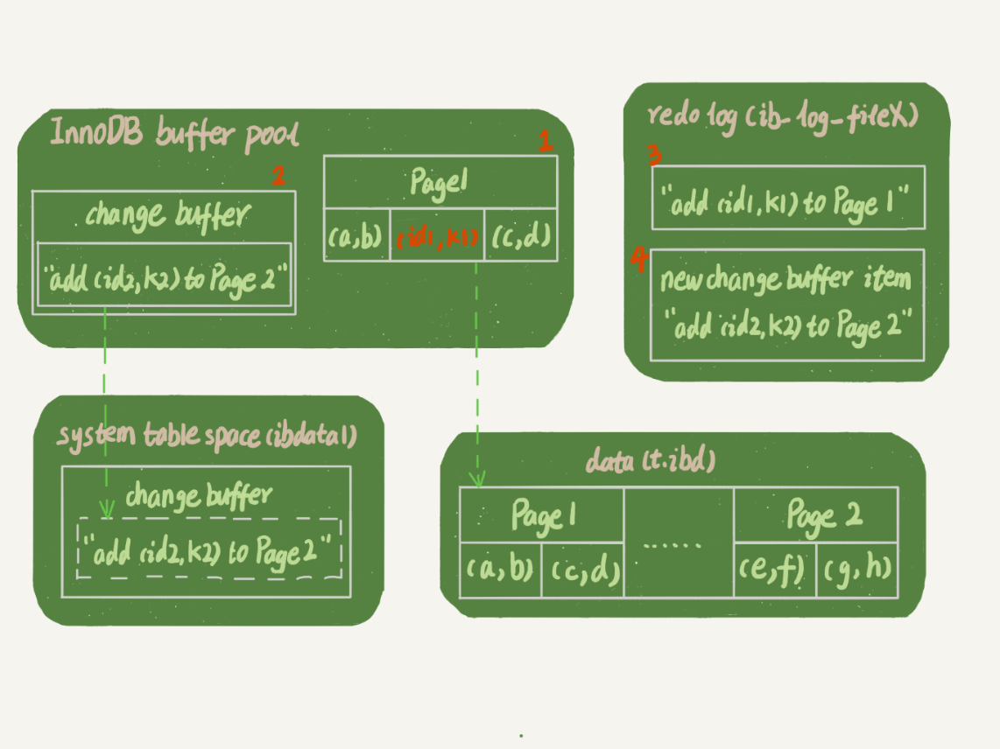
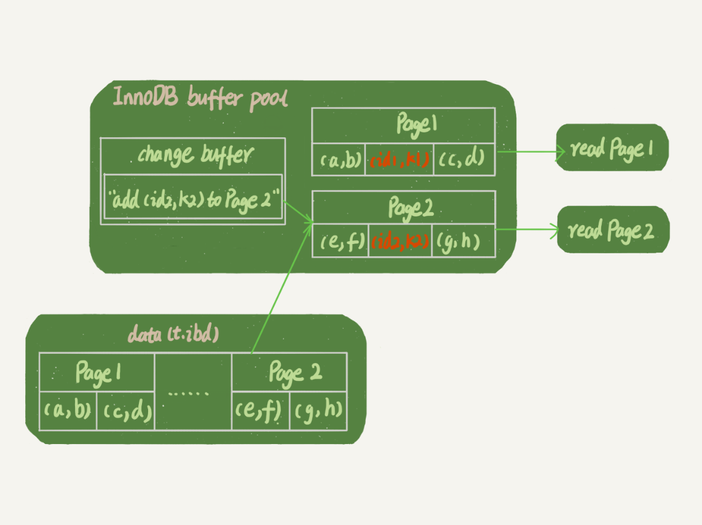

# 普通索引和唯一索引该如何选择

<div style="width: 75%; margin: 0 auto">
    
    <div class="text-center">图 1</div>
</div>

## 两种索引的查询过程

假设执行的查询是 ```select id from T where k = 5```，这个查询从 B+ 树根节点开始，搜索到右下角的数据页，数据页内部通过二分法来定位记录。
* 对于普通索引来说，查找到第一个 (5,500) 的记录后，继续查找下一个记录，直到出现第一个 k !=5 的记录
* 对于唯一索引来说，由于索引定义了唯一性，查找到满足条件的第一个记录后，就停止检索

> 实际这个区别对性能的差距影响微乎其微
> 
> InnoDB 的数据是按数据页为单位读写的。也即，当读一条记录时，并不是只把这一条记录从磁盘中读取出来，而是以页为单位，将其整体读入内存。在 InnoDB 中，每个数据页默认大小是 <span class="success-color font-strong">16KB</span>
>
> 也因此，当找到第一条 k = 5 的数据的时候，他所在的数据页就已经读入内存了。那么对普通索引来说，要多做的 “查找和判断下一条记录” 的操作，只需要一次指针寻找和一次计算。
>
> 当然，如果 k = 5 恰好时当前数据页的最后一个记录，则必须读取下一个数据页了。
>
> 对于整型来说，一个数据页可以放近千个 key，可以认为出现这种情况的概率会很低。所以当我们计算平均性能差异时，仍可以认为这个操作成本对于现在的 CPU 来说可以忽略不计。

--------------

## 两种索引的更新过程

要知道两种索引对更新性能影响这个问题，需要先了解一下 ```change buffer```。

### change buffer

当要更新一个数据时，如果这条数据已经在内存中就之间更新，而如果这个数据还没有在内存中，在不影响数据一致性的情况下，InnoDB 会将这些更新操作缓存在 change buffer 中，这样就不需要从磁盘中读取这个数据页了。在下次查询需要这个数据页的时候，将数据页读入内存，然后执行 change buffer 中与这个页相关的操作。通过这种方式保证这个数据逻辑的正确性。

虽然名字是 change buffer 但它是可以持久化的数据的，持久化到系统表空间（```ibdata1```），同时 ```redo log``` 也会记录 change buffer 的改动，同样之后写入系统表空间。change buffer 在内存中有拷贝，也会写入磁盘中。

将 change buffer 中的操作应用到原数据页，得到最新结果的过程称为 ```merge```。出来访问这个数据页会触发 merge 外，系统后台也有线程会定期 merge。数据库在正常 shutdown 的时候也会 merge。

显然，如果将更新操作先记录在 change buffer 中，减少读磁盘，语句的执行速度会得到明显提升。同时，数据读入内存也是要占用 buffer pool 的，所以这种方式还能避免占用内存，提高内存利用率。

### 使用 change buffer 的条件

对于唯一索引来说，所有的更新操作都要判断这个操作是否违反唯一性约束，而判断需要把数据页读入内存才可以进行。既然都读入内存了，直接更新就很快了，没必要用 change buffer。

因此，普通索引更新才能使用 change buffer。

change buffer 用的是 buffer pool 的内存，因此不能无线增大。change buffer 的大小可以用参数 ```innodb_change_buffer_max_size``` 设置。如设为 50，则代表最多可以占用 buffer pool 的 50%。

### 更新过程

如果要插入一行 (4,400) 的数据，处理流程如下：

第一种情况，这个记录已经在内存中了。
* 对于唯一索引，找到 3 和 5 之间的位置，判断到没有冲突，插入这个值，执行结束
* 对于普通索引，找到 3 和 5 之间的位置，插入这个值，执行结束

这种情况，由于判断，会消耗 CPU 时间

第二种情况，这个记录要更新的目标页不在内存中，处理流程如下
* 对于唯一索引来说，需要将数据页读入内存，判断到没有冲突，插入这个值，执行结束
* 对于普通索引来说，则是将更新记录在 change buffer，操作就结束

将数据从磁盘读入内存设计随机 IO 的访问，是数据库里面成本最高的操作之一。change buffer 因为减少了随机磁盘访问，所以对更新性能的提升是会很明显的。

---------

## change buffer 的使用场景

由上面可以知道，普通索引上可以使用 change buffer。那么，所有情况下，change buffer 都可以提升性能吗。

因为 merge 的时候，是真正更新的时候，而 change buffer 的主要目的就是将记录的变更动作缓存下来，所以在一个数据页做 merge 之前，change buffer 记录的变更越多，收益就越大。

因此，对于写多读少的业务来说，change buffer 的使用效果最好。比如常见的账单、日志系统。

## change log 和 redo log

如果要执行一下语句
```sql
insert into t(id,k) values(id1,k1),(id2,k2);
```
假设 k 索引树的状态，k1 所在的数据页在内存（InnoDB buffer pool）中，k2 所在的数据页不在内存中

<div>
    
    <div class="text-center">图 2 带 change buffer 的更新过程</div>
</div>

分析这条执行语句，涉及四个部分：内存、redo log（ib_log_fileX）、数据表空间（t.ibd）、系统表空间（ibdata1）。
1. Page1 在内存中，直接更新
2. Page2 没有在内存中，就在内存中的 change buffer 区域，写下 “向 Page2 插入一行” 这个信息
3. 将上述两个动作记录到 redo log中（图中3 和 4）

做完上面的，事务就算完成了。可以看到，更新的成本很低，只写了两次内存，然后写了磁盘（两次操作和在一起写了一次磁盘），而且还是顺序写。

同时，图中的两个虚线是后台操作，不影响更新的响应时间。

那么对于之后的读请求，会怎么处理呢。

假设现在执行 select * from t where k in (k1,k2)。如果读过程发生在更新语句后不久，内存中的数据还在，此时两个读操作就和系统空间表（ibdata1）和 redo log（ib_log_fileX）无关了。

<div>
    
    <div class="text-center">图 3 带 change buffer 的读过程</div>
</div>

可以看到
1. 读 Page1 的时候。直接从内存返回。
2. 读 Page2 的时候，需要把 Page2 从磁盘读入内存，然后应用 change buffer 里面的操作日志，生成一个正确的版本并返回。

简单对比 redo log 和 change buffer 在更新上的收益，redo log 主要节省了随机写磁盘的 IO 消耗（转成顺序写），而 change buffer 主要节省的是随机读磁盘的 IO 消耗。

> redo log 与 change buffer (含磁盘持久化) 这2个机制，不同之处在于——优化了整个变更流程的不同阶段。 
> 
> 先不考虑 redo log、change buffer机制，简化抽象一个变更(insert、update、delete)流程： 
> 1. 从磁盘读取待变更的行所在的数据页，读取至内存页中。
> 2. 对内存页中的行，执行变更操作
> 3. 将变更后的数据页，写入至磁盘中。 
> 
> 步骤1，涉及随机读磁盘IO；步骤3，涉及随机写磁盘IO
>
> change buffer机制，优化了步骤1——避免了随机读磁盘IO Redo log机制，优化了步骤3——避免了随机写磁盘 IO，将随机写磁盘，优化为了顺序写磁盘(写redo log，确保crash-safe)
>
> 在我们mysql innodb中， change buffer机制不是一直会被应用到，仅当待操作的数据页当前不在内存中，需要先读磁盘加载数据页时，change buffer才有用武之地。 redo log机制，为了保证crash-safe，一直都会用到。
>
> 有无用到 change buffer 机制，对于 redo log 这步的区别在于—— 用到了 change buffer 机制时，在 redo log 中记录的本次变更，是记录 new change buffer item 相关的信息，而不是直接的记录物理页的变更。


<link rel="stylesheet" type="text/css" href="../../style.css" />