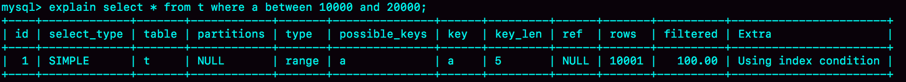
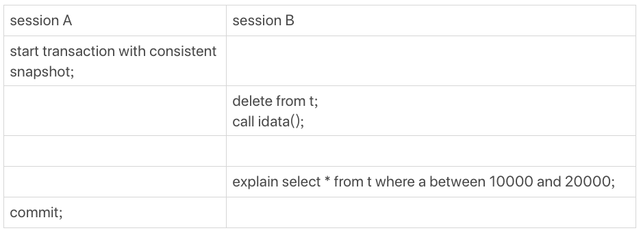
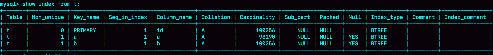
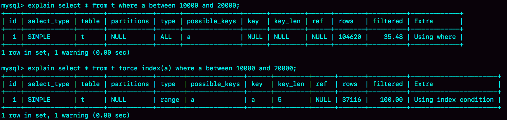
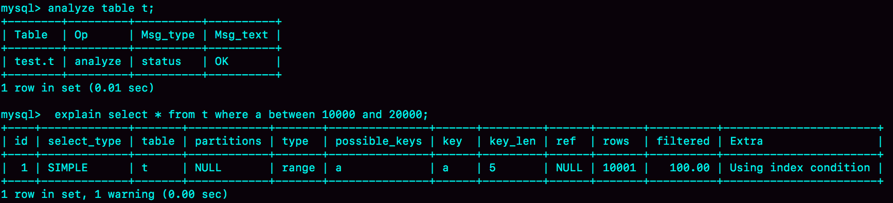
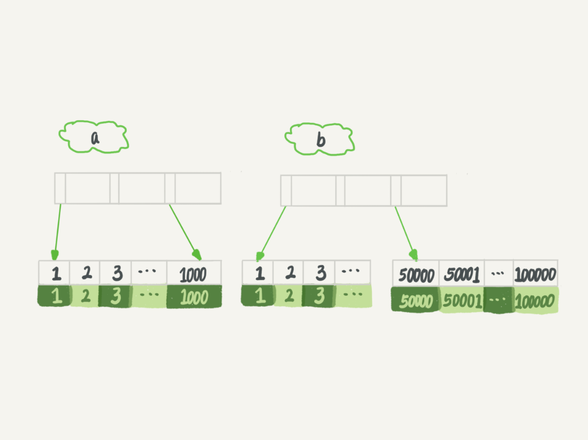
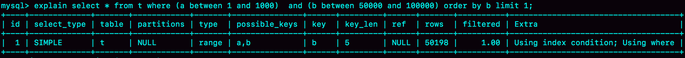
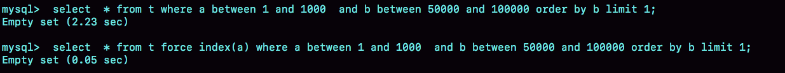
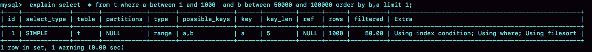
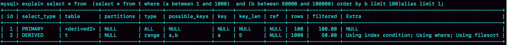

# MySQL为什么有时会选错索引

MySQL 的优化器负责选择哪个索引。有时会出现选错索引的情况。

```sql
CREATE TABLE `t` (
  `id` int(11) NOT NULL AUTO_INCREMENT,
  `a` int(11) DEFAULT NULL,
  `b` int(11) DEFAULT NULL,
  PRIMARY KEY (`id`),
  KEY `a` (`a`),
  KEY `b` (`b`)
) ENGINE=InnoDB;
```
接下来，往里面填充 100000 条数据
```sql
delimiter ;;
create procedure idata()
begin
  declare i int;
  set i=1;
	start transaction;
  while(i<=100000)do
    insert into t(a,b) values(i, i);
    set i=i+1;
  end while;
	commit;
end;;
delimiter ;
call idata();
```
执行语句
```sql
select * from t where a between 10000 and 20000;
```
查看执行情况
<div>
    
    <div class="text-center">图 1 语句执行过程</div>
</div>
key 字段是 a，表明优化器选择了索引 a，符合预期。

如果接下来，按如下操作。
<div class="picture-75">
    
    <div class="text-center">图 2 session A、B 执行过程</div>
</div>

这时候 session B 的查询语句就不选择索引 a 了。可以通过慢查询日志（slow log）来查看具体执行情况。
> 慢查询日志通过 ```slow_query_log``` 开启，慢查询时间可以通过 ```long_query_time``` 设置，日志路径由 ```slow_query_log_file``` 决定。

```sql
set global slow_query_log = 'ON';
set long_query_time = 0;
select * from t where a between 10000 and 20000; /*Q1*/
select * from t force index(a) where a between 10000 and 20000;/*Q2*/
```

可以看到慢查询日志

```sql
# User@Host: root[root] @ localhost [::1]  Id:     3
# Query_time: 0.028091  Lock_time: 0.000054 Rows_sent: 10001  Rows_examined: 100000
SET timestamp=1632129556;
select * from t where a between 10000 and 20000;

# User@Host: root[root] @ localhost [::1]  Id:     3
# Query_time: 0.015580  Lock_time: 0.000048 Rows_sent: 10001  Rows_examined: 10001
SET timestamp=1632129561;
select * from t force index(a) where a between 10000 and 20000;
```

可以看到，Q1 扫描了 10 万行，显然走了全表扫描，用了 28ms。Q2 扫描了 10001 行，执行了15ms。也即，如果没有使用 force index 的时候，MySQL 用错了索引，导致了更长的执行时间。

---

## 优化器的逻辑

优化器选择索引的目的，就是找到一个最优的执行方案，并用最小的执行代价去执行语句。在数据库里面，扫描行数是影响执行代价的因素之一。扫描的行数越少，意味着访问磁盘数据的次数越少，消耗的 CPU 资源越少。

当然，扫描行数也不是唯一判断标准，优化器还有结合是否使用临时表、是否排序等因素进行综合判断。

上面 session B 中的查询不涉及临时表和排序，那一定是索引判断出现了问题。

那么问题就是：扫描行数是如何判断的。

### 扫描行数是如何判断的

MySQL 在真正执行语句之前，并不能精确地知道满足这个条件的记录有多少条，而只能根据统计信息来估算记录数。

这个统计信息就是索引的 “区分度”。显然，一个索引上不同的值越多，这个索引的区分度就越好。而一个索引上的不同的值的个数，我们称之为基数（cardinality）。基数越大，索引的区分度越好。

可以用 show index 方法，看到一个索引的基数。如图 3 所示。
<div>
    
    <div class="text-center">图 3 表 t show index 结果</div>
</div>

那么，MySQL 是如何得到索引的基数的呢

### 索引的基数的确定

MySQL 使用采样统计。因为把整张表的数据取出来一行行统计，代价太高了，所以只能选择 “采样统计”。

采样统计的时候，InnoDB 默认会选择 N 个数据页，统计这些页面上的不同值，得到一个平均值，然后乘以这个索引的页面数，就得到了这个索引的基数。

而数据表是会持续更新的，索引统计信息也不会固定不变。所以，当变更的数据行树超过 1/M 是，会自动触发重新做一次索引统计。

在 MySQL 中，有两种存储索引统计的方式，可以通过设置参数 ```innodb_stats_persistent``` 来选择：
* 当设置为 ON 时，表示统计信息会持久化。这时，默认 N = 20，M = 10
* 当设置为 OFF 时，表示统计信息只存储在内存中。这时，默认 N = 8，M = 16

由于是采样统计，不管 N 是 20 还是 8，这个基数都是很不准的。

但这不是全部，因为从图 3 可以看到，虽然索引统计值（cardinality 列）不够精确，但大体上还是差不多的，选错索引一定还有别的原因。

其实索引统计只是一个输入，对于一个具体的语句来说，优化器还要判断，执行这个语句本身要扫描多少行。
<div>
    
    <div class="text-center">图 4 explain 结果</div>
</div>

rows 这个字段显示的是预计扫描行数

其中，Q1 的结果还是符合预期的，rows 的值是 104620；但是 Q2 的 rows 值是 37116，偏差就大了。而图 1 可以看到，rows 是只有 10001 行，是这个偏差误导了优化器的判断。

这里可能有个疑问，优化器为什么放着 37000 行的执行计划不使用，却选择了扫描行数是 10 万行 得到执行计划呢？

<span class="success-color">因为 a 是二级索引，需要回表，这个代价也是优化器需要计算进去的。</span>

而如果选择扫描 10 万行，是直接在主键索引上扫描的，没有额外代价。

优化器会估算这两个选择的代价，从结果来看，优化器认为直接扫描主键索引更快。当然，从执行直接来看，这个选择不是最优的。

使用普通索引需要把回表的代价算进去，在图 1 执行 explain 的时候，也考虑了这个策略，但图 1 的选择是正确的。也就是说，这个策略并没有问题。

因此，MySQL 选错索引，这里归咎为没能准确判断出扫描行数。
> 这里判断扫描行数错误，是因为删除的数据只是标记删除，数据仍然在数据页中，后插入的数据需要找新的空位插入，这样查询时会扫描删除的数据 + 后插入的数据，同时算上回表扫描主键索引，因此扫描行数达到 37000 行
>> session A 开启的事务是 RR 级别，会创建一个一致性读视图； session B 的删除会产生记录的新版本（空记录），同时会产生新的 Undo Log； 一致性读视图需要的 Undo Log 是不会删除的，意味着 session B 产生的删除记录的 Undo Log 是不能删除的，意味着记录的当前版本（空记录）不能真的从磁盘上被删掉，因为如果记录都从磁盘上删掉了，那么空有 Undo Log 也无法回到 session A 应该看到的那个版本；就好比链表总得有个头结点把，如果失去了对头结点的引用，就失去了访问整个链表的起点； 不删除的情况下，记录还在数据页上占着空间呢，session B 又把数据加回来，导致索引的数据页出现大量的分裂； 大量的页分裂，导致了 cardinality 的不准；

既然统计信息不对，那就修正。```analyze table t``` 命令，可以用来重新统计索引信息。可以看到，用上了索引 a。
<div>
    
    <div class="text-center">图 5 analyze table t 命令执行后的 explain 结果</div>
</div>

<span class="success-color">因此在实践中，如果发现 explain 的结果预计的 rows 数和实际情况插件比较大，可以用这个方法处理。</span>

其实，如果只是索引统计不准确，通过 analyze 命令可以解决很多问题，但是优化器不是只看扫描行数。

执行如下语句
```sql
select * from t where (a between 1 and 1000)  and (b between 50000 and 100000) order by b limit 1;
```
结果上看，这个查询没有符合的记录，返回空集合。
<div>
    
    <div class="text-center">图 6 a b 索引结构图</div>
</div>

如果使用索引 a，那么只要扫描前 1000 个值，然后取到对应的 id，再回表查询，然后根据字段 b 来过滤。显然这样只用扫描 1000 行。

如果使用索引 b 进行查询，需要扫描后 50001 个值。

那么他的执行计划如下。
<div>
    
    <div class="text-center">图 7 执行计划</div>
</div>

可以看到，这次优化器选择了索引 b，rows 字段显示需要扫描 50198 行。所以：
1. 扫描的行数估计值依然不准确
2. MySQL 又选择错了索引

## 索引选择异常和处理

大多数时候，优化器都可以正确选择索引，但偶尔还是会出现索引不正确的情况。这时候应该如何解决。

<span class="success-color font-strong">一个方法是，采用 force index 强行选择一个索引。</span>MySQL会根据词法解析的结果分析可能可以使用的索引作为候选项，然后在候选项中一次判断每个索引需要扫描多少行。如果 force index 指定的索引在候选索引列表中，就直接选择这个索引，不再评估其他索引的执行代价。

因此，查询可以改为
```sql
select * from t force index(a) where (a between 1 and 1000)  and (b between 50000 and 100000) order by b limit 1;
```
<div>
    
    <div class="text-center">图 8 两个语句耗时</div>
</div>

但是由于，要么不喜欢用 force index，要么索引变更了名字，或者迁移了数据库，就不再兼容。所以数据库的问题，最好是在数据库内部解决。

既然优化器放弃了使用索引 a，说明 a 还不够合适，所以<span class="success-color font-strong">第二个方法是，我们可以考虑修改语句，引导 MySQL 使用我们期望的索引</span>。这个语句中，可以把 ```order by b limit 1``` 改为 ```order by b,a limit 1```，语义的逻辑是一样的。

看下执行后的效果：
<div>
    
    <div class="text-center">图 9 改为 order by b,a limit 1 的执行结果</div>
</div>

之前优化器选择使用索引 b，是因为他认为使用索引 b 可以避免排序（b 本身是索引，已经是有序的了，如果选择索引 b 的话，不需要再做排序，只需要遍历），所以即使扫描行数变多，也判定为代价小。

现在 order by b,a 这种写法，要求按照 b,a 排序，就意味着使用这两个索引都需要排序。因此，扫描行数成了影响决策的主要条件，于是此时优化器选择了只要扫描 1000 行的索引 a。

同时，这种修改是恰好有个 limit 1，因此如果有满足条件的记录 order by b limit 1 和 order by b,a limit 1 都会返回 b 是最小的那一行，逻辑上一致才可以这么做。

如果觉得修改语义不太好，也可以改成下面的语句
```sql
select * from (select * from t where (a between 1 and 1000)  and (b between 50000 and 100000) order by b limit 100)alias limit 1;
```
<div>
    
    <div class="text-center">图 10 改写后的执行计划</div>
</div>
我们用 limit 100 让优化器意识到，使用 b 索引代价是很高的。其实是我们根据数据特征诱导了一下优化器，也不具备通用性。

<span class="success-color font-strong">第三个方法是，在某些场景下，我们可以建立一个更合适的索引，来提供给优化器做选择，或者删掉误用的索引</span>。


<link rel="stylesheet" type="text/css" href="../../style.css" />