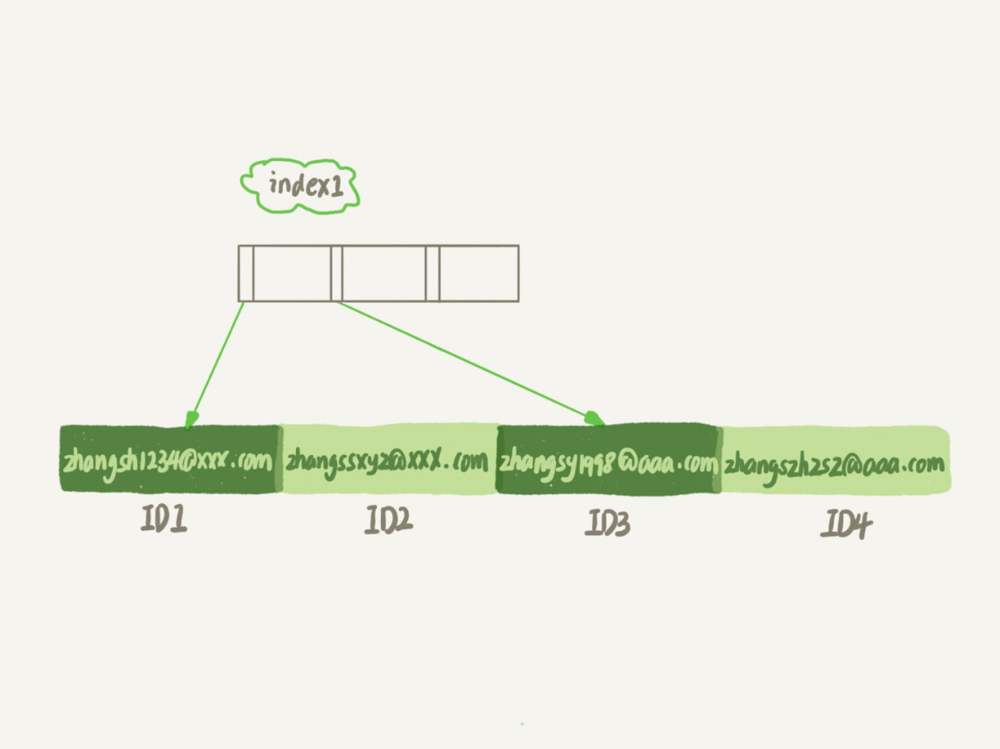

# 怎么给字符串加索引

假设一用户表
```sql
create table SUser(
ID bigint unsigned primary key,
email varchar(64), 
... 
)engine=innodb; 
```
如果有针对 email 的查询，最好在上面建立索引
```sql
alter table SUser add index index1(email); -- 整个字符串
-- 或
alter table SUser add index index2(email(6)); -- 字符串前6个字符
```
> 对于非二进制的字符串类型（CHAR、VARCHAR、TEXT），CREATE TABLE、ALTER TABLE、CREATE INDEX 语句会将前缀索引的长度解释为字符数。 对于二进制的字符串类型（BINARY、VARBINARY、BLOG），则会将其解释为字节数。 不过最终存储的索引长度肯定是按字节数来计算的。 参考官方文档 https://dev.mysql.com/doc/refman/5.7/en/create-index.html#create-index-column-prefixes

<div style="width: 75%; margin: 0 auto">
    
    
    <div class="text-center">图 1 两个索引结构</div>
</div>

可以看到，email(6) 索引因为只取前 6 个自己二，所以占用的空间更小，这就是前缀索引的优势。但是，他会带来额外的扫描次数。

```sql
select id,name,email from SUser where email='zhangssxyz@xxx.com';
```

* 如果使用 index1
1. 从 index1 索引中找到 'zhangssxyz@xxx.com' 的记录，取得 ID2
2. 回到主表找到主键为 ID2 的行，判断 email 的值是否正确，，将这行记录加入结果集
3. 取 index1 索引树的下一条记录，直到不满足条件，循环结束

这个过程回主键取一次数据，系统认为只扫描了一行。

* 如果使用 index2
1. 从 index2 索引中找到 'zhangs' 的记录，找到第一个 ID1
2. 到主键上超导主键值是 ID1 的行，判断 email 的值不满足条件，丢弃记录
3. 取 index2 上下一行记录，发现仍然是 'zhangs'，取出 ID2 回表判断 email 值，正确，加入结果集
4. 重复直到 index2 上的值不是 'zhangs'

这个过程回主键索引取了 4 次数据，扫描了 4 行。

容易发现，如果使用前缀索引，可能增加扫描行数。

如果定义的 index2 不是 email(6) 而是 email(7)，那么满足前缀 'zhangss' 的记录只有一条，只需扫描一行。

因此，<span class="success-color font-strong">使用前缀索引要定义好长度，就可以做到既节省空间，又不用额外增加太多查询的成本</span>。

于是就有一个问题：应该使用多长的前缀呢。

我们建立索引的时候，关注的是区分度，区分度越高越好。因为区分度越高，意味着重复的键值越少。因此，我们可以通过统计索引上有多少个不同的值来判断要使用多长的前缀。

首先，如下语句统计不同值
```sql
select count(distinct email) as L from SUser;
```
然后统计不同前缀的不同值
```sql
select 
  count(distinct left(email,4)）as L4,
  count(distinct left(email,5)）as L5,
  count(distinct left(email,6)）as L6,
  count(distinct left(email,7)）as L7,
from SUser;
```
当然，使用前缀索引可能会损失区分度，所以要预估一个可接受的损失值，比如 5%。然后在 L4~L7 中，选出不低于 L * 95% 的值，假如 L6 L7都满足，那可以选择 6.

## 前缀索引对覆盖索引的影响

```sql
select id,email from SUser where email='zhangssxyz@xxx.com';
```
这个语句只要求返回 id 和 email。如果使用 index1(email) 那么可以利用覆盖索引，无需回表。如果使用 index2(email(6)) ，则必须回表。

## 其他方式

对于邮箱来说，前缀索引的效果可能还不错。如果前缀索引的区分度不好，还有什么办法呢？

例如我国的身份证，同县的人，前 6 位一般相同。这样，按前面的前缀索引，区分度就非常低了。也许可以增长前缀索引的长度，但是这样一来，一个是索引存储空间增大，占用的磁盘空间越大，一个数据页能放下的索引值就越少，查询效率也会越低。

有没有方法，占用更小的空间，达到相同的查询效率呢。

<span class="success-color font-strong">第一种方式是使用倒序存储。</span>然后每次查询，反转值。
```sql
select field_list from t where id_card = reverse('input_id_card_string');
```
身份证后 6 位没有重复的逻辑，这 6 位可能就提供了区分度。

<span class="success-color font-strong">第二种方式是使用 hash 字段。</span>可以在表上在创建一个整数字段，用来保存身份证的校验码，同时在这个字段创建索引。

```sql
alter table t add id_card_crc int unsigned, add index(id_card_crc);
```

然后每次插入新纪录时，都同时用 crc32() 这个函数得到校验码填到这个新字段。由于校验码可能存在冲突，因此要再加上等值判断。

```sql
select field_list from t where id_card_crc=crc32('input_id_card_string') and id_card='input_id_card_string'
```

这样索引的长度变成了 4 个字节

<span class="success-color">两种方法的同异：</span>

他们的相同点是，都不支持范围查询。倒序存储的字段上的索引是按照倒序字符串的方式排序的，已经没有办法利用索引方式查出身份证号码在 [ID_X, ID_Y] 的所有市民。同样的，hash 字段的方式也只能支持等值查询。
> 倒序和hash都将数据打散，数据没有按照原有字符串的顺序排列。在进行范围查询时，需要进行顺序扫描，此时的扫描范围就会是全表。

他们的区别，主要体现在三方面：
1. 从占用的额外空间来看，倒序存储方式在主键索引上，不会消耗额外的存储空间，而 hash 字段方法需要增加一个字段。当然，倒序存储使用 4 个字段长度应该是不够的，如果长一点，这个消耗也和 hash 字段差不多抵消了。
2. 在 CPU 消耗方面，倒序方式每次读和写的时候，都要额外调用一次 reverse 函数，而 hash 字段的方式需要额外调用一次 crc32 函数。如果只从计算的复杂度来看，reverse 函数额外消耗的 CPU 资源会小些
3. 从查询效率看，使用 hash 字段的方式查询性能要稳定点。因为 crc32 算出来的值虽然有概率冲突，但是概率非常小，可以认为每次查询的评价扫描行数接近 1.而倒序存储方式毕竟还是使用前缀索引的方式，还是会增加扫描行数。


<link rel="stylesheet" type="text/css" href="../../style.css" />