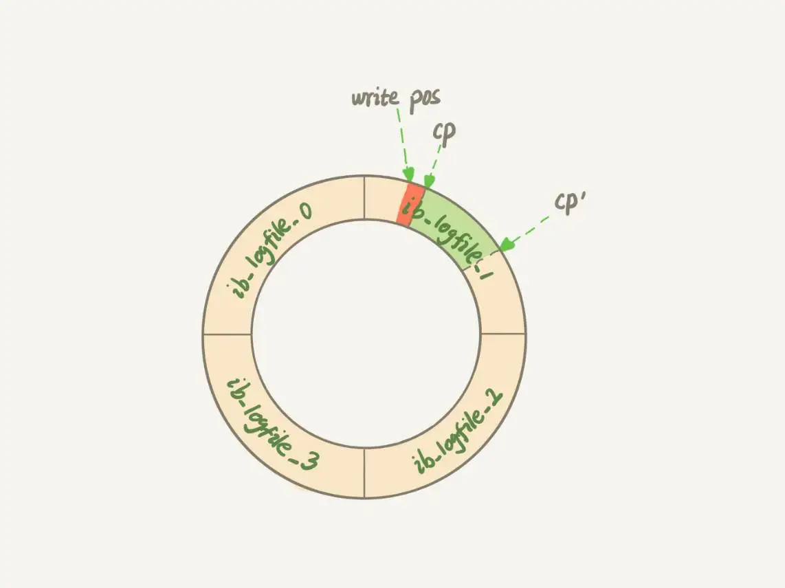
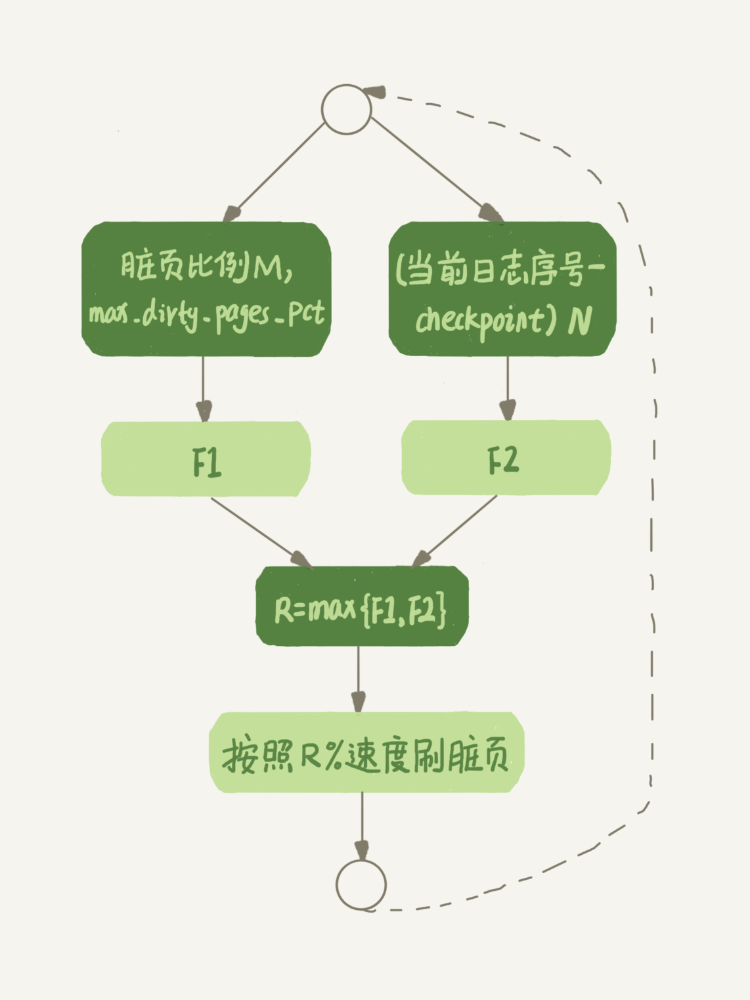

# MySQL 查询有时候变得特别慢

一条 SQL 语句，正常执行的时候特别快，但是有时候也不知道怎么回事，它就会变得特别慢，并且这样的场景很难复现，它不止随机，而且时间还很短。

## 你的 SQL 语句为什么变慢了

在前边 [02_日志系统_SQL更新语句的执行](../base/02_日志系统_SQL更新语句的执行.md) 有提到 WAL 机制。InnoDB 在处理更新语句的时候，只做了写日志这一个磁盘操作。这个日志叫作 redo log（重做日志），在更新内存写完 redo log 后，就返回给客户端，本次更新成功。

把内存的数据写入磁盘的过程，就是 flush。在 flush 之前，内存和磁盘上的文件是不一致的。<span class="success-color font-strong">当内存数据页和磁盘数据页内容不一致时，我们称这个内存页为脏页。内存数据写入到磁盘后，内存和磁盘上的数据页的内容就一致了，称为“干净页”。</span>

## 什么情况下会引发 flush 过程

* 第一种场景就是 `InnoDB` 的 `redo log` 写满了。这时候系统会停止所有更新操作，把 `checkpoint` 往前推进，`redo log` 留出空间可以继续写

<div style="width: 75%; margin: 0 auto">
    
    <div class="text-center">图 1</div>
</div>

图 1 中，把 `checkpoint` 位置从 CP 推进到 CP'，就需要将两点之间的日志（浅绿色部分）,对应的脏页都 flush 到磁盘上。之后，途中从 write pos 到 CP' 之间可以再写入 `redo log` 区域

* 第二种场景就是系统内存不足。当需要新的内存页，而内存不够用的时候，就需要淘汰一些数据页，空出内存给其他数据页使用。如果淘汰的是 “脏页”，就要将脏页写到磁盘。数据页有两种状态：

  * 一种是内存里存在，内存肯定是正确的结果，直接返回
  * 另一种是内存没有数据，就可以肯定数据文件上是正确的结果，读入内存后返回。这样效率最高
    
* 第三种场景是，MySQL 认为系统“空闲”的时候，也会刷一点 “脏页”。

* 第四种情况是，MySQL 正常关闭，这时会把内存的脏页都 flush 到磁盘上。

以上四种情况。第三种属于系统空闲时的操作，系统没什么压力；第四种是系统关闭时的操作。这两种情况下，我们都不太关心性能问题。

第一种是，“`redo log` 写满了，要 flush 脏页”。这种情况是一定要避免的。因为出现这种情况时，整个系统都不能接受更新了，所有的更新都必须堵住。

第二种是 “内存不够用了，要先把脏页写到磁盘”，这种情况是常态。<span class="font-strong">InnoDB 用缓冲池（buffer pool）管理内存，缓冲池中的内存有三种状态：</span>
* 第一种是，还没有使用
* 第二种是，使用了并且是干净页
* 第三种是，使用了并且是脏页

InnoDB 的策略是尽量使用内存，因此对于一个长时间运行的系统，没有使用的页面很少。

而当要读入的数据页没有在内存里面时，就必须到缓冲池中申请一个数据页。这时候只能把最久不使用的数据页从内存中淘汰掉：如果要淘汰掉的是个干净页，就直接释放出来复用；但如果是脏页，就必须把脏页先刷到磁盘，变成干净页后使用。

所以，刷脏页虽然是常态，但是出现以下情况，还是会影响性能：
* 一个查询要淘汰的脏页太多，会导致查询的响应时间明显变长
* 日志写满，更新全部堵住，写性能跌为 0，这种情况对敏感业务来说，是不能接受的

所以，InnoDB 需要有脏页比例控制的机制，来避免上面两种情况。

## InnoDB 刷脏页的控制策略

现在说下 InnoDB 的脏页控制策略，以及和这些策略相关的参数。

首先要正确告诉 InnoDB 所在主机的 IO 能力，这样 InnoDB 才能知道需要全力刷脏页的时候，可以刷多快。

这时候要用到 `innodb_io_capacity` 这个参数了，它会告诉 InnoDB 你的磁盘能力。<span class="bold success-color">这个值建议设置为磁盘的 IOPS</span>。磁盘的 IOPS 可以通过 fio 这个工具来测试，使用以下命令来测试磁盘随机读写：

```sh
fio -filename=$filename -direct=1 -iodepth 1 -thread -rw=randrw -ioengine=psync -bs=16k -size=500M -numjobs=10 -runtime=10 -group_reporting -name=mytest 
```

如果没有正确设置，比如低于磁盘的 IO 能力，那么 InnoDB 会认为系统 IO 能力就这么点，所以刷脏页特别慢，甚至比脏页生成的速度还慢，这样就造成了脏页累计，影响了查询和更新性能。

虽然已经定义了 “全力刷脏页” 的行为，但不会平时一直刷脏页，因为磁盘能力除了刷脏页，也要处理用户请求。接下来看看 InnoDB 怎么控制引擎按照 “全力” 的百分比来刷脏页。

InnoDB 的刷盘熟读要参考两个因素：<span class="bold success-color">一个是脏页比例，一个是 redo log 写盘速度</span>。

InnoDB 会根据这两个因素先单独计算出两个数字。

参数 `innodb_max_dirty_pages_pct` 是脏页比例上限，默认值是 75%。InnoDB 会根据当前的脏页比例（假设为 M），计算出一个范围在 0 到 100 之间的数字，计算这个数字的代码类似这样

```c
F1(M)
{
  if M>=innodb_max_dirty_pages_pct then
      return 100;
  return 100*M/innodb_max_dirty_pages_pct;
}
```

InnoDB 每次写入日志都有一个序号（LSN，log sequence number），当前写入的序号跟 checkpoint 对应的序号之间的差值，我们假设为 N。InnoDB 会根据这个 N 计算出一个范围在 0 到 100 之前的数字，这个计算公式可以记为 F2(N)，算法比较复杂，N 越大，就按出的值越大。

然后，<span class="bold success-color">根据计算得到的 F1(M) F2(N) 两个值，取较大值记为 R，之后引擎就按照 `innodb_io_capacity` 定义的能力乘以 R% 来控制刷脏页的速度</span>。

<div style="width: 75%; margin: 0 auto">
    
    <div class="text-center">图 2</div>
</div>

所以，InnoDB 有试会在后台刷脏页，而刷脏页的过程要将内存写入磁盘。因此，无论是查询语句在需要内存的时候要求淘汰一个脏页，还是刷脏页的逻辑会占用 IO 资源影响更新语句，都可能是影响 MySQL 查询变慢的原因。

为了避免这种情况，需要合理设置 `innodb_io_capacity` 的值，<span class="bold success-color">平时多关注脏页比例，不要让他接近75%</span>。

其中，脏页比例是通过 Innodb_buffer_pool_pages_dirty/Innodb_buffer_pool_pages_total 得到，具体命令如下:
```sql
select VARIABLE_VALUE into @a from global_status where VARIABLE_NAME = 'Innodb_buffer_pool_pages_dirty';
select VARIABLE_VALUE into @b from global_status where VARIABLE_NAME = 'Innodb_buffer_pool_pages_total';
select @a/@b;
```

再来看一个有趣的策略：

一旦一个查询请求需要在执行过程中先 flush 一个脏页时，这个查询就可能要比平时慢了。而 MySQL 中的一个机制，可能会让你的查询更慢：在准备刷掉一个脏页时，如果这个数据页旁边的数据页刚好也是脏页，就会把这个脏页一起刷掉；而且这个逻辑还会向下蔓延，即对于每个相邻数据页，如果它也是脏页的话，也会放到一起刷。

在 InnoDB 中，`innodb_flush_neighbors` 参数就是用来控制这个行为的，值为 1 的时候，就会发生上面的行为，为 0 则只刷自己。

这个机制在机械硬盘时代是很有意义的，可以减少很多随机 IO。机械硬盘的随机 IOPS 一般只有几百，相同的逻辑操作减少随机 IO 就意味着系统性能的大幅度提升。

如果使用的是 SSD 这类 IOPS 比较高的设备的话，建议把 `innodb_flush_neighbors` 这个参数设置为 0.因为这时候 IOPS 往往不是瓶颈，而只刷自己能更快地执行完必要的刷脏页操作，减少 SQL 语句响应时间

在 MySQL 8.0 中，`innodb_flush_neighbors` 参数的默认值已经是 0 了。

<link rel="stylesheet" type="text/css" href="../../style.css" />