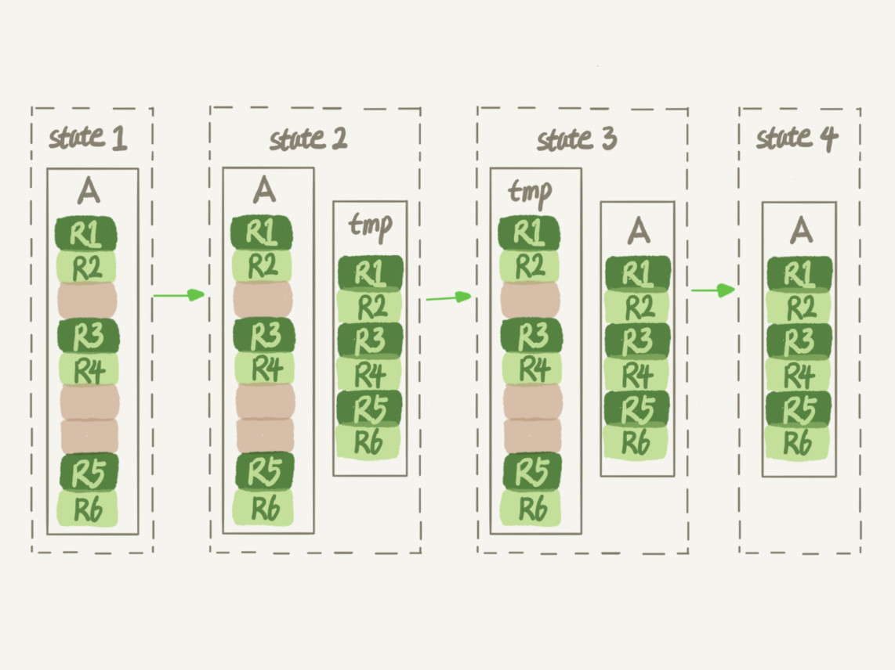

# 数据库表空间的回收

数据库占用空间太大，把最大的表删掉了一半的数据，为什么表文件的大小还是没变。

InnoDB 表包含两个部分，即：表结构定义和数据。在 MySQL 8.0 版本以前，表结构是存在以 .frm 为后缀的文件里。而 MySQL 8.0 版本，则允许把表结构放在系统数据表中了。因为表结构定义占用的空间很小，所以主要讨论数据

## 参数 `innodb_file_per_table`

表数据既可以存在共享表空间里，也可以是单独的文件。这个行为是参数 `innodb_file_per_table` 控制的

1. 这个参数设置为 OFF 表示的是，表的数据放在系统共享表空间，也就是跟数据字典放在一起
2. 这个参数设置为 ON 表示的是，每个 InnoDB 表数据存储在一个以 .ibd 为后缀的文件中

从 MySQL 5.6.6 版本开始，它的默认值就是 ON 了。

建议不管使用哪个 MySQL 版本，都将这个值设置为 ON。因为一个表单独存储为一个文件更容易管理，而且在不需要这个表的时候，通过 drop table 命令，系统会直接删除这个文件。而如果放在共享表空间中，即使表删掉了，空间也是不会回收的。

所以，将 `innodb_file_per_table` 设置为 ON，是推荐做法，接下来的讨论都是基于这个设置展开的。

我们在删除表的时候，可以使用 drop table 命令回收表空间。但是，我们遇到更多的删除数据的场景是删除某些行。回到开头的问题：表中的数据删除了一半，但是表空间没有被回收。

要知道这个问题需要从数据删除流程说起。

## 数据删除流程

如下图 InnoDB 中索引的示意图。在前面索引的文章 [04_索引_深入浅出索引](../base/04_索引_深入浅出索引.md) 中知道，InnoDB 中的数据都是用 B+ 树的数据结构组织的。

<div style="width: 75%; margin: 0 auto">
    
    <div class="text-center">图 1</div>
</div>

假设，我们要删掉 R4 这个记录，InnoDB 引擎只会把 R4 这个记录标记为删除。如果智慧要再插入一个 ID 在 300 和 600 之前的记录时，可能会复用这个位置。但是磁盘文件的大小不会缩小。

InnoDB 的数据是按页存储的，那么如果删掉了一个数据页上的所有记录，会怎样。

答案是，整个数据页就可以复用了。

但是，<span class="success-color bold">数据页的复用和记录的复用是不同的</span>。

记录的复用，只限于符合范围条件的数据。比如上面的 R4 被删除后，如果插入的是 ID 为 400 的数据，那可以直接复用这个空间。但如果插入的是一个 ID 为 800 的数据，就不能复用这个位置了。

而当整个页从 B+ 树里面摘掉后，可以复用到任何位置。以图 1 为例，如果将数据 page A 上的所有记录删除后，page A 会标记为可复用。这时候如果要插入一条 ID = 50 的数据需要使用新页的时候，page A 是可以被复用的。

如果相邻的两个数据页利用率都很小，系统会把两个页上的数据合到其中一个页上，另一个数据页就标记为可复用。

进一步，如果我们使用 `delete` 命令删除整个表的数据呢？结果就是全部数据页都标记为可复用，但是磁盘上的文件不会小。

现在知道了，`delete` 命令只是把记录的位置，或者数据页标记为了 “可复用”，但磁盘的文件大小是不会变的。也就是说 `delete` 命令是不能回收表空间的。这些可以复用，但是没有被使用的空间，看起来像是空洞。

实际上，<span class="success-color bold">不止是删除数据会造成空洞，插入数据也会</span>。

<span class="success-color bold">如果数据是按照索引的递增顺序插入的，那么索引是紧凑的。但如果数据是随机插入的，就可能引起索引的数据页分裂</span>。

假设图 1 中 page A 已经满了，这时再插入一行数据，会怎么样呢？

<div style="width: 75%; margin: 0 auto">
    
    <div class="text-center">图 2 插入数据导致页分裂</div>
</div>

可以看到，由于 page A 满了，再插入一个 ID 是 550 的数据时，就不得不再申请一个新的页面 page B 来保存数据了。页分裂完成后，page A 的末尾就留下了空洞（注意：实际可能不止一个记录的位置是空洞）。

另外，更新索引上的值，可以理解为删除一个旧的值，再插入一个新的值。不难理解，这也是会造成空洞的。

也就是说，经过大量增删改的表，都是可能存在空洞的。所以，如果能把这些空洞去掉，就能达到收缩表空间的目的。

而重建表，就可以达到这样的目的。

## 重建表

试想一下，如果现在有一个表 A，需要做表空间收缩，为了把表中存在的空洞去掉，可以怎么做呢？

你可以新建一个与表 A 结构相同的表 B，然后按主键 ID 递增的顺序，把数据一行一行地从表 A 里读出来再插入表 B 中。

由于表 B 是新建的表，所以表 A 主键索引上引起的空洞，在表 B 中就都不存在了。显然地，表 B 的主键索引更紧凑，数据页的利用率页更高。如果我们把表 B 作为临时表，数据从表 A 导入表 B 的操作完成后，用表 B 替换 A，从效果上看，就起到了收缩表 A 空间的作用。

这里，你可以使用 `alter table A engine=innoDB` 命令来重建表。在 MySQL 5.5 版本之前，这个命令的执行流程和我们前面描述的差不多，区别只是这个临时表 B 不需要自己创建，MySQL 会自动完成转存数据、交换表名、删除旧表的操作。

<div style="width: 75%; margin: 0 auto">
    
    <div class="text-center">图 3 改表锁 DDL</div>
</div>

显然，花时间最多的步骤就是往临时表插数据的过程，如果在这个过程中，有新的数据要写入到表 A 的话，就会造成数据的丢失。因此，在 DDL 过程中，表 A 中不能有更新。也就是说，这个 DDL 不是 online 的。

而在 <span class="success-color font-strong">MySQL 5.6 版本开始引入的 Online DDL，对这个操作流程做了优化</span>。

1. 建立一个临时文件，扫描表 A 主键的所有数据页
2. 用数据表 A 的记录生成 B+ 树，存储到临时文件中
3. 生成临时文件的过程中，将所有对 A 的所有操作记录在一个日志文件（row log）中，对应的是图中 state2 的状态
4. 临时文件生成后，将日志文件中的操作应用到临时文件，得到一个逻辑数据上与表 A 相同的数据文件，对应的就是图中 state3 的状态
5. 用临时文件替换表 A 的数据文件

<div style="width: 75%; margin: 0 auto">
    
    <div class="text-center">图 4 Online DDL</div>
</div>

可以看到，与图 3 过程的不同之处在于，由于日志文件和重放操作这个功能的存在，这个方案在重建表的过程中，允许对表 A 做增删改操作。<span class="success-color">这也就是 Online DDL 名字的来源</span>。

[05_全局锁和表锁](../base/05_全局锁和表锁.md)

alter 语句在启动的时候，需要获取 MDL 写锁，但这个写锁在真正拷贝数据之前就退化成读锁了。退化成读锁是为了不阻塞增删改操作；不直接解锁是为了防止其他线程对这个表同时做 DDL。

对于一个大表来说，Online DDL 最耗时的过程就是拷贝数据到临时表的过程，这个步骤的执行期间可以接受增删改操作。所以，对于整个 DDL 过程来说，锁的时间非常短。对业务来说，就可以认为是 Online 的。

需要补充的是，上述的这些重建方法都会扫描原表数据和构建临时文件。对于很大的表来说，这个操作是很消耗 IO 和 CPU 资源的。因此，如果是线上服务，需要很小心地控制操作时间。如果想要比较安全的操作的话，<span class="success-color">可以使用 GitHub 开源的 gh-ost 来做</span>。

## Online 和 inplace

在图 3 中，我们把表 A 中的数据导出来的存放位置叫做 tmp_table。这是一个临时表，是在 server 层创建的。

在图 4 中，根据表 A 重建出来的数据是放在 “tmp_file” 里的，这个临时文件是 InnoDB 在内部创建出来的。整个 DDL 过程都是在 InnoDB 内部完成。对于 server 层来说，没有把数据挪动到临时表，是一个 “原地” 操作，这就是 “inplace” 名称的来源。

所以，如果有个 1TB 的表，现在磁盘空间是 1.2TB，就不能做 inplace 的 DDL 了。因为 tmp_file 也是要占用临时空间的。

重建表 `alter table A engine=InnoDB` 命令的隐含意思是
```sql
alter table A engine=innoDB,ALGORITHM=inplace;
```

跟 inplace 对应的就是拷贝表的方式了，用法是
```sql
alter table A engine=innoDB,ALGORITHM=copy;
```

当使用 `ALGORITHM=copy` 的时候，表示的是强制拷贝表，对应的流程就是图 3 的操作过程。

需要注意的是，inplace 和 Online 不是一个意思，只是刚好在重建表的逻辑中是这样。

比如，如果要给 InnoDB 表的一个字段加全文索引，写法是
```sql
alter table t add FULLTEXT(field_name);
```

这个过程是 inplace 的，但会阻塞增删改操作，是非 Online 的。

如果说这两个逻辑之间的关系是什么的话，可以概括为
1. DDL 过程如果是 Online 的，就一定是 inplace
2. 反过来未必，也就是说 inplace 的 DDL，有可能不是 Online 的。截止到 MySQL 8.0，添加全文索引（FULLTEXT index）和空间索引（SPATIAL index）就属于这种情况

再延伸以下：optimize table、analyze table 和 alter table 这三种方式重建表的区别
* 从 MySQL 5.6 版本开始，alter table t engine=innodb （也就是 recreate）默认的就是上面图 4 的流程了
* analyze table t 骑士不是重建表，只是对表的索引信息做重新统计，没有修改数据，这个过程中加了 MDL 读锁
* optimize table t 等于 recreate + analyze
* truncate table t 等于 drop + create

> 有时候会出现一种情况：“想要收缩表空间，结果适得其反”
> 1. 一个表 t 文件大小为 1TB
> 2. 对这个表执行 alter table t engine=innodb
> 3. 发现执行完成后，表空间不仅没有缩小，反而大了一点，比如 1.01TB
>
> 发生这种情况的原因可能是在 DDL 期间，如果刚好外部有 DML 在执行，可能会引入新的空洞
> 还有一个更深刻的机制：在重建表的时候，InnoDB 不会把整张表占满，每个页留了 1/16 给后续更新用。也就是说，重建表智慧不是最紧凑的
> 1. 将表 t 重建一次
> 2. 插入一部分数据，但是插入的这些数据，用掉了一部分空间
> 3. 这种情况下，再重建一次表 t，就可能

<link rel="stylesheet" type="text/css" href="../../style.css" />