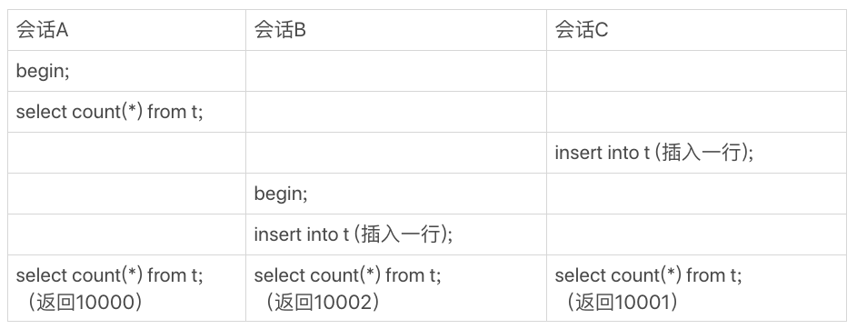
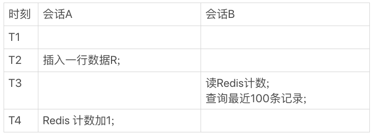
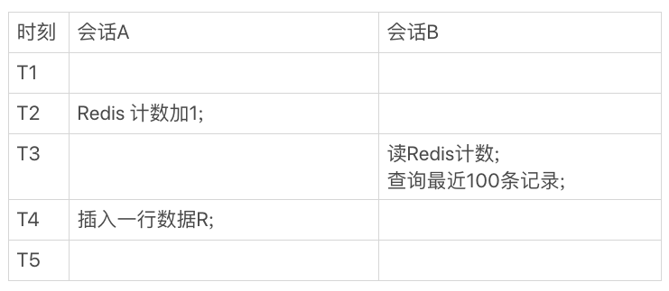
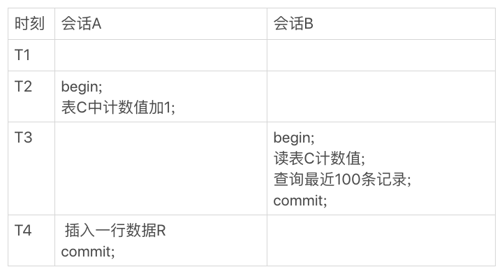

# count(*)这么慢，我该怎么办

在开发中，可能经常需要计算一个表的行数，这时你可能会想，一条 select count(*) from t 语句不久解决了吗。但是随着系统中记录越来越多，这条语句执行得也会越来越慢

## count(*) 的实现方式

首先需要明确的是，在不同的 MySQL 引擎中，count(*) 有不同的实现方式。

* MyISAM 引擎把一个表的总行数存在了磁盘上，因此执行 count(*) 的时候会直接返回这个数，效率很高
* InnoDB 引擎执行 count(*) 的时候，需要把数据一行一行地从引擎里面读出来，然后累计计数

值得注意的是，这里讨论的是不带过滤条件的 count(*)，如果加了 where 条件，MyISAM 表也是不能返回这么快的。

那为什么 InnoDB 不跟 MyISAM 一样，也把数字存起来呢？

这时因为即使是在同一个时刻的多个查询，由于多版本并发控制（MVCC）的原因，InnoDB 表 “应该返回多少行” 也是不确定的，这里用一个算 count(*) 的例子来解释下

假设表 t 中现在有 10000 条数据，我们设计了三个用户并行的会话

* 会话 A 先启动事务并查询一次表的总行数
* 会话 B 启动事务，插入一行记录后，查询表的总行数
* 会话 C 先启动一个单独的语句，插入一行记录后，查询表的总行数

假设从上到下是按时间顺序执行的，同一行语句是在同一个时刻执行的

    
    
图 1 会话 A、B、C 的执行流程

可以看到在最后一个时刻，三个会话 A、B、C 会同时查询表 t 的总行数，但拿到的结果却不同。

这和 InnoDB 的事务设计有关系，可重复读是它默认的隔离级别，在代码上就是通过多版本并发控制，也就是 MVCC 来实现。每一行记录都要判断自己是否会对这个会话可见，因此对于 count(*) 请求来说，InnoDB 只好把数据一行一行地读出依次判断，可见的行才能够用于计算“基于这个查询”的总行数。

> MVCC 见 [03_事务隔离_实现方式](../base/03_事务隔离_实现方式.md) 和 [07_事务_是隔离的还是不隔离的](../base/07_事务_是隔离的还是不隔离的.md)

当然，执行 count(*) 也有做优化的。

InnoDB 是索引组织表，主键索引树的叶子节点是数据，而普通索引树的叶子节点是主键值。所以，普通索引树比主键索引树小很多。对于 count(*) 这种操作，遍历哪个索引树得到的结果在逻辑上都是一样的。因此，MySQL 优化器会找到最小的那棵树来遍历。在保证结果逻辑正确的前提下，尽量减少扫描的数据量，是数据库设计的通用法则之一。

如果用过 `show table status` 命令的话，会发现这个命令的输出结果里面也有一个 TABLE_ROWS 用于显示这个表当前有多少行，这个命令执行挺快，那这个 TABLE_ROWS 能代替 count(*) 吗？

在 [09_MySQL为什么有时会选错索引](../base/09_MySQL为什么有时会选错索引.md) 中有提到，索引的统计值是通过采样来估计的。实际上，TABLE_ROWS 就是这个采样估算得来的，因此它也很不准，官方文档说误差可能达到 40% 到 50%。所以，`show table status` 命令显示的行数也不能直接使用。

到此，我们小结一下
> * MyISAM 表虽然 count(*) 很快，但是不支持事务
> * show table status 命令虽然返回很快，但是不准确
> * InnoDB 表直接 count(*) 会遍历全表，虽然结果准确，但会导致性能问题

回到开头的问题，如果需要经常计算表总操作树那到底该怎么办呢。答案是，只能自己计数。

下面就来讨论自己计数有哪些办法，那些办法的优缺点又有哪些。

方法的基本思路，需要自己找一个地方，把操作表的行数存起来。

## 用缓存系统保存计数

对于更新很频繁的库来说，你可能会第一时间想到，用缓存系统来支持。

你可以用一个 redis 服务来保存这个表的总行数。这个表每被插入一行 Redis 计数就加一，每被删除一行 Redis 计数就减一，读和更新操作都横跨，但你再想一下这种方式存在什么问题吗？

没错，缓存系统可能会丢失更新。

Redis 的数据不能永远地留在内存里，所以你会找一个地方把这个值定期地持久化存储起来。但即使这样，仍然可能丢失更新。试想如果刚刚再数据表中插了一行，Redis 中保存的值也加了一，然后 Redis 重启了，重启后你要从存储 Redis 数据的地方把这个值读回来，而刚刚加一的这个计数操作却丢失了。

当然了，这还是有解的。比如 Redis 异常重启一行，到数据库单独执行一次 count(*) 获取真实的行数，再把这个值写回到 Redis 里就可以了。异常重启毕竟不是经常出现的情况，这一次全表扫描的成本，还是可以接受的。

但实际上，将计数保存在缓存系统中的方式，还不只是丢失更新的问题，即使 Redis 正常工作，这个值还是逻辑上不精确的。

假设有一个页面，要显示操作记录的总数，同时还要显示最近操作的 100 条记录。那么，这个页面的逻辑就需要先到 Redis 里面取出计数，再到数据表里面取数据记录。

我们是这么定义不精确的

1. 一种是，查到的 100 行结果里面有最新插入记录，而 Redis 的计数里还没加 1
2. 另一种是，查到的 100 行结果里没有最新的插入记录，而 Redis 的计数里已经加了 1

这两种情况，都是逻辑不一致的。

    
    
图 2 会话 A、B 的执行流程

在图 2 中，会话 A 是一个插入交易记录的逻辑，往数据表里插入一行 R，然后 Redis 计数加 1；会话 B 就是查询页面显示时需要的数据。

而在图 2 的这个时序里，在 T3 时刻会话 B 来查询的时候，会显示出新插入的 R 这个记录，但是 Redis 的计数还没加 1.这时候，就会出现我们说的数据不一致。

如果换一下。

    
    
图 3 调整顺序后，会话 A、B 的执行流程

这时候就反过来了，会话 B 在 T3 时刻查询的时候，Redis 计数加了 1，但还查不到新插入的 R 这一行，也是数据不一致的情况。

在并发系统里面，我们时无法精确控制不同线程的执行时刻的，因为存在图中的这种 操作序列，所以，我们说即使 Redis 能正常工作，这个计数值还是逻辑上不精确的。

## 在数据库保存计数

根据上面的分析，用缓存系统保存计数有丢失数据和计数不精确的问题。那么，如果我们把这个计数直接放到数据库里单独一张计数表 C 中，又会怎么样呢？

首先，这解决了崩溃丢失的问题，InnoDB 是如何支持崩溃恢复不丢失数据的。
> 见 [02_日志系统_SQL更新语句的执行](../base/02_日志系统_SQL更新语句的执行.md)

然后，我们再看看能不能解决计数不精确的问题。

也许你会说，这不一样的吗？无非是把图 3 中对 Redis 的操作变成对计数表 C 的操作。只要出现图 3 的这种执行序列，这个问题还是无解的吧？

本文要解决的问题，就是由于 InnoDB 要支持事务，导致 InnoDB 表不能把 count(*) 直接存起来，然后查询时直接返回。

但是我们可以利用事务的特性把这个问题解决掉。

    
    
图 4 会话 A、B 的执行时序图

看下现在的执行结果，虽然会话 B 的读操作仍然时在 T3 执行，但是因为这时候更新事务还没有提交，所以计数值加 1 这个操作对会话 B 还不可见。

因此，会话 B 看到的结果里，查计数值和最近 100 条记录看到的结果，逻辑上就是一致的。

## 不同的 count 用法

count(*)、count(主键)、count(字段) 和 count(1) 等不同用法之前的性能有哪些差别。

首先，要明白 count() 的语义。count() 是一个聚合函数，对于返回的结果集，一行行地判断，如果 count 函数的参数不是 NULL，累计值就加 1，否则不加。最后返回累计值。

所以，count(*)、count(主键) 和 count(1) 都表示返回满足条件的结果集的总行数；而 count(字段)，则表示返回满足条件的数据行里面，参数 “字段” 不为 NULL 的总个数。

至于分析性能差别的时候，可以记住这几个原则：

1. server 层要什么给什么
2. InnoDB 只给必要值
3. 现在的优化器只优化了 count(*) 的语义为 “取行数”，其他 “显而易见” 的优化并没有做

对于 count(主键id) 来说，InnoDB 引擎会遍历整张表，把每一行的 id 值都取出来，返回给 server 层。server 层拿到 id 后，判断是不可能为空的，就按行累加。

对于 count(1) 来说，InnoDB 引擎遍历整张表，但不取值。server 层对于返回的每一行，放一个数字 1 进去，判断是不可能为空的，按行累加。

单看这两种用法的差别的话，你能对比出来，count(1) 执行得要比 count(主键id)快。因为从引擎返回 id 会涉及到解析数据行，以及拷贝字段值得操作。

对于 count(字段) 来说

1. 如果这个字段是定义为 not null 的话，一行行地从记录里面读出这个字段，判断不能为 null，按行累加
2. 如果这个字段定义允许为 null，那么执行的时候，判断到有可能是 null，还要把值取出来再判断下，不是 null 才累加

也就是前面的第一条原则，server 层要什么数据，InnoDB 就返回什么字段。

但是 count(*) 是例外，并不会把全部字段取出来，而是专门做了优化，不取值。count(*) 肯定不是 null，按行累加。

结论是，按效率排序的话 count(字段) < count(主键 id) < count(1) ≈ count(\*)，所以我建议你，尽量使用 count(\*)。

<link rel="stylesheet" type="text/css" href="../../style.css" />