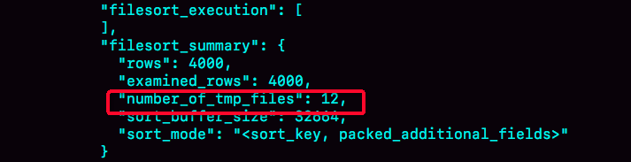
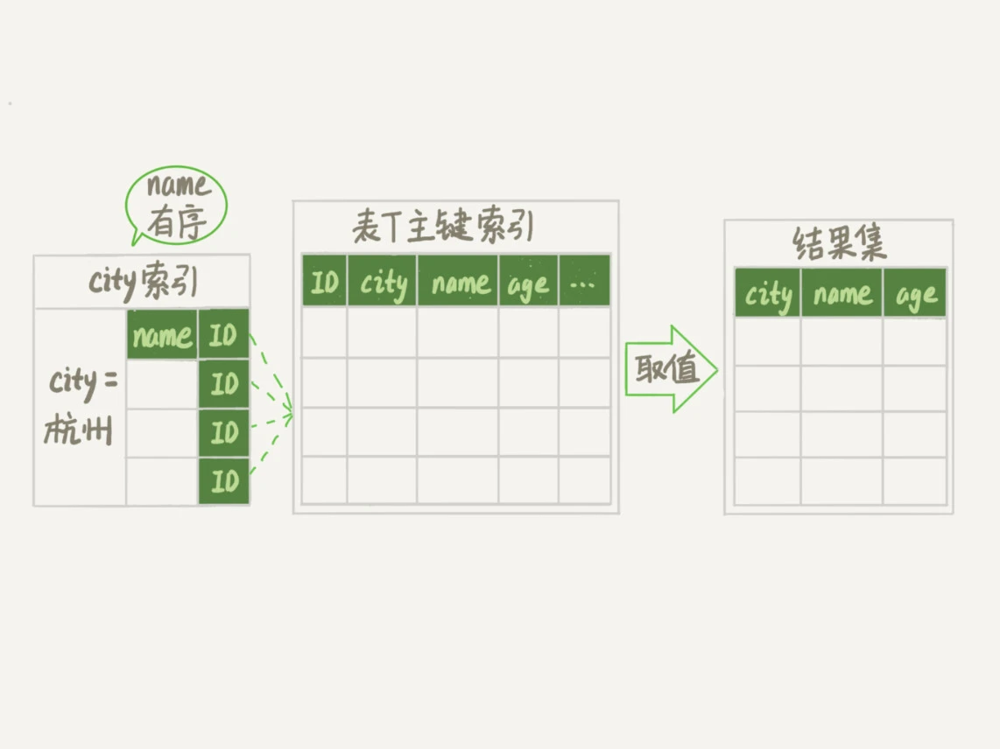
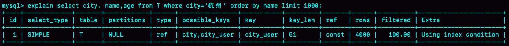
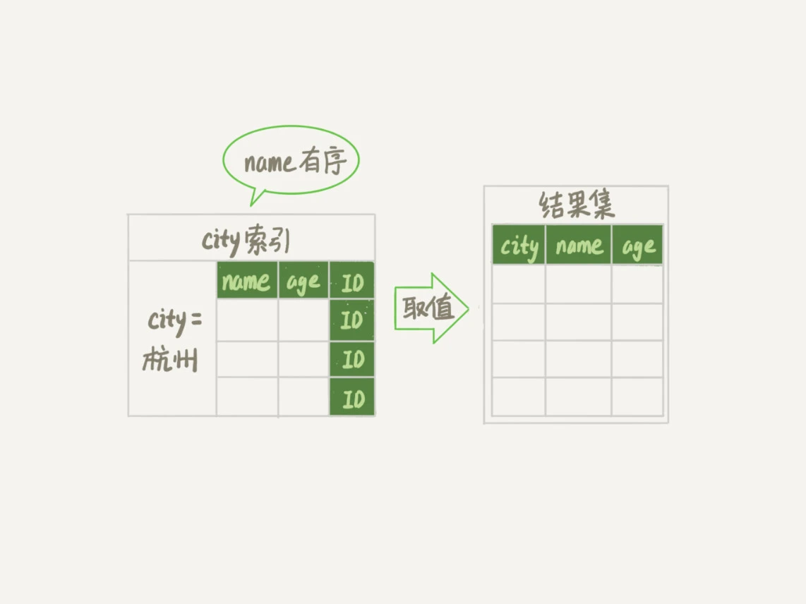

# “order by” 是怎么工作的？

实际开发中，经常会遇到需要根据指定字段排序来显示结果的需求。假设你要查询城市是“杭州”的所有人名字，并且按照姓名排序返回前 1000 个人的姓名、年龄。

表定义如下：
```sql
CREATE TABLE `t` (
  `id` int(11) NOT NULL,
  `city` varchar(16) NOT NULL,
  `name` varchar(16) NOT NULL,
  `age` int(11) NOT NULL,
  `addr` varchar(128) DEFAULT NULL,
  PRIMARY KEY (`id`),
  KEY `city` (`city`)
) ENGINE=InnoDB;
```
这时，SQL 语句可以这么写
```sql
select city,name,age from t where city='杭州' order by name limit 1000;
```
这次来了解下这个语句是怎么执行的，以及有什么参数会影响执行的行为。

## 全字段排序

前面说过索引。为了避免全表扫描，我们需要在 city 字段加上索引。

在 city 字段加上索引后，用 explain 命令来看看这个语句的执行情况。

<div style="margin: 0 auto">
    
    <div class="text-center">图 1 使用 explain 命令查看语句的执行情况</div>
</div>

`Extra` 这个字段中的 “`Using filesort`” 表示的就是需要排序，MySQL 会给每个线程分配一块内存用于排序，称为 `sort_buffer`。

为了说明这个 SQL 的执行流程，先看下这个索引的示意图。

<div style="width: 75%; margin: 0 auto">
    
    <div class="text-center">图 2 city 字段的索引示意图</div>
</div>

从图中可以看到，满足 city='杭州’条件的行，是从 ID_X 到 ID_(X+N) 的这些记录。

通常情况下，这个语句执行流程如下所示：
1. 初始化 sort_buffer，确定放入 name、city、age 这三个字段
2. 从索引 city 找到第一个满足 city='杭州' 条件的主键 id，也就是图中的 ID_X
3. 到主键 id 索引取出整行，取 name、city、age 三个字段的值，存入 sort_buffer 中
4. 从索引 city 取下一个记录的主键 id
5. 重复步骤 3、4 知道 city 的值不满足查询条件为止，对应的主键 id 也就是图中的 ID_Y
6. 对 sort_buffer 中的数据按照字段 name 做快速排序
7. 按照排序结果取前 1000 行返回给客户端。

我们暂且把这个排序过程，称为全字段排序，执行流程的示意图如下所示

<div style="width: 75%; margin: 0 auto">
    
    <div class="text-center">图 3 全字段排序</div>
</div>

图中 “按 name 排序” 这个动作，可能在内存中完成，也可能需要使用外部排序，这取决于排序所需的内存和参数 `sort_buffer_size`。

> sort_buffer_size，就是 MySQL 为排序开辟的内存 （sort_buffer）的大小。如果要排序的数据量小于 sort_buffer_size，排序就在内存中完成。但如果排序数据量太大，内存放不下，则不得不利用磁盘临时文件辅助排序。

可以用下面的方法，来确定一个排序语句是否使用了临时文件。

```sql
/* 打开optimizer_trace，只对本线程有效 */
SET optimizer_trace='enabled=on'; 
/* @a保存Innodb_rows_read的初始值 */
select VARIABLE_VALUE into @a from performance_schema.session_status where variable_name = 'Innodb_rows_read';
/* 执行语句 */
select city, name,age from t where city='杭州' order by name limit 1000; 
/* 查看 OPTIMIZER_TRACE 输出 */
SELECT * FROM `information_schema`.`OPTIMIZER_TRACE`\G
/* @b保存Innodb_rows_read的当前值 */
select VARIABLE_VALUE into @b from performance_schema.session_status where variable_name = 'Innodb_rows_read';
/* 计算Innodb_rows_read差值 */
select @b-@a;
```
这个方法是通过查看 OPTIMIZER_TRACE 的结果来确认的，你可以从 `number_of_tmp_files` 中看到是否使用了临时文件

<div style="margin: 0 auto">
    
    <div class="text-center">图 4 全排序的 OPTIMIZER_TRACE 部分结果</div>
</div>

number_of_tmp_files 表示的是排序使用的临时文件数。内存放不下时，就需要使用外部排序，外部排序一般使用归并排序算法。对于这里就是，<span class="success-color bold">MySQL 将要排序的而数据分成 12 份，每一份单独排序后存在这些临时文件中。然后把这 12 个有序文件再合并成一个有序的大文件</span>。

如果 `sort_buffer_size` 超过了需要排序的数据量的大小，`number_of_tmp_files` 就是 0，表示排序可以直接在内存中完成。

示例表中有 4000 条满足 city='杭州' 的记录，所以 `examined_rows` = 4000，表示参与排序的行数是 4000 行。

`sorted_mode` 里面的 packed_additional_fields 的意思是，排序过程对字符串做了“紧凑”处理。即使 name 字段的定义是 varchar(16) 在排序过程中还是要按照实际长度来分配空间的。

同时，最后一个查询语句 select @b-@a 的返回结果是 4000，表示整个执行过程只扫描了 4000 行。

这里为了避免对结果造成干扰，将 `internal_tmp_disk_storage_engine` 设置成 MyISAM。否则 select @b - @a 的结果会显示为 4001。

这时因为查询 OPTIMIZER_TRACE 这个表，需要用到临时表，而 `internal_tmp_disk_storage_engine` 的默认值是 InnoDB。如果是使用 InnoDB 引擎的话，把数据从临时表取出来的时候，会让 Innodb_rows_read 的值加 1。

## rowid 排序

在上面这个算法过程里面，只对原表的数据读了一遍，剩下的操作都是在 sort_buffer 和临时文件中执行的。但这个算法有一个问题，就是如果查询要返回的字段很多的话，那么 srot_buffer 里面要放的字段太多，这样内存里能同时放下的行数很少，要分成很多个临时文件，排序的性能会很差。

如果单行很大，这个方法效率不够好。

怎么让 MySQL 认为单行长度太大呢？

可以修改参数
```sql
SET max_length_for_sort_data = 16;
```

`max_length_for_sort_data` 是 MySQL 中专门控制用于排序的行数据的长度的一个参数，它的意思是，如果单行的长度超过这个值，MySQL 就认为单行太大，要换一个算法。

city、name、age 这三个字段的定义总长度是 36，把 `max_length_for_sort_data` 设置为 16，看看计算过程有什么改变。

新算法放入 sort_buffer 的字段，只要有排序的列和主键 id。

但这时，排序的结果就因为少了 city 和 age 字段的值，不能直接返回了，整个执行流程就变成如下所示的样子：

1. 初始化 sort_buffer，确定放入两个字段，即 name 和 id
2. 从索引 city 找到第一个满足 city='杭州' 条件的主键 id，也就是图中的 ID_X
3. 从主键 id 索引取出整行，取 name、id 这两个字段，存入 sort_buffer 中
4. 从索引 city 取下一个记录的主键 id
5. 重复步骤 3、4 知道不满足 city='杭州' 条件为止，也就是图中的 ID_Y
6. 对 sort_buffer 中的数据按照字段 name 进行排序
7. 遍历排序结果，取前 1000 行，并按照 id 的值回到原表中取出 city、name 和 age 三个字段返回给客户端

这个执行流程的示意图如下，称之为 rowid 排序

<div style="margin: 0 auto">
    
    <div class="text-center">图 5 rowid 排序</div>
</div>

对比图 3 全字段排序，rowid 排序多访问了一次表 t 的主键索引，就是步骤 7。

最后的结果集是一个逻辑概念，实际上 MySQL 服务器从排序后的 sort_buffer 中一次取出 id，然后到原表查出 city、name 和 age 这三个字段的结果，不需要在服务端再耗费内存存储结果，而是直接返回客户端的。

相比全字段排序，OPTIMIZER_TRACE 的结果首先，`examined_rows` 的值还是 4000，表示用于排序的数据是 4000 行。但是 select @b-@a 这个语句的值变成 5000 了。

因为这个时候除了排序过程外，在排序完成后，还要根据 id 去原表取值。由于语句是 limit 1000，因此会多出 1000 行。

<div style="width: 75%; margin: 0 auto">
    
    <div class="text-center">图 6 rowid 排序的 OPTIMIZER_TRACE 部分输出</div>
</div>

从 OPTIMIZER_TRACE 结果来看，另外两个信息也变了。

* `sort_mode` 变成了 <sort_key, rowid>，表示参与排序的只有 name 和
 id 两个字段
* `number_of_tmp_files` 变成了 10，是因为这时候参与排序的行数虽然仍然是 4000 行，但是每一行都变小了，因此需要排序的总数据量就变小了，需要的临时文件也相应变少了

## 全字段排序 VS rowid 排序

对比两个执行流程。

如果 MySQL 担心内存太小，影响排序效率，才会使用 rowid 排序，这样排序过程中一次可以排序更多行，但是需要回到原表去取数据。

如果 MySQL 认为内存足够大，会优先选择全字段排序，把需要排序的字段都放到 sort_buffer 中，这样排序后就会直接从内存中返回查询结果了，不用再回原表去取数据。

这体现了 MySQL 的一个设计思想：<span class="success-color bold">如果内存足够，就要多利用内存，尽量减少磁盘访问</span>。

对 InnoDB 表来说，rowid 排序会要求回表多造成磁盘读，因此不会被优先选择。

MySQL 做排序是一个成本比较高的操作。之所以排序要生成临时表，是因为原来排序的数据是无序的。

如果能保证从 city 索引上取出的数据是天然按 name 排序，那是不是可以不用排序了。

可以建立一个 city 和 name 的联合索引
```sql
alter table t add index city_user(city, name);
```
<div style="width: 75%; margin: 0 auto">
    
    <div class="text-center">图 7 city 和 name 联合索引示意图</div>
</div>

在这个索引里，依然可以用树搜索的方式定位到第一个满足 city='杭州' 的记录，并且额外确保了，接下来只要 city 是杭州，name 就一定是有序的。

这个查询的流程就变成了

1. 从索引 (city, name) 找到第一个满足 city='杭州' 条件的主键 id
2. 到主键 id 索引取出整行，取 name、city、age 三个字段的值，作为结果集的一部分直接返回
3. 从索引 (city, name) 取下一个记录主键 id
4. 重复步骤 2、3，知道查到 1000 条记录，或者不满足 city='杭州' 条件时循环结束
<div style="width: 75%; margin: 0 auto">
    
    <div class="text-center">图 8 引入 (city,name) 联合索引后，查询语句的执行流程</div>
</div>

可以看到这个查询不需要临时表也不需要排序。用 explain 看看执行计划。

<div style="margin: 0 auto">
    
    <div class="text-center">图 9 引入 (city,name) 联合索引后，查询语句的执行计划</div>
</div>

可以看到 ，Extra 字段没有 Using filesort 字段了，也就是不需要排序了。而且由于 (city, name) 这个联合索引本身有序，所以这个查询也不用把 4000 行全部读一遍，只要找到满足条件的前 1000 条记录就可以退出了。只需扫描 1000 次。

有没有可能进一步简化呢。[04_索引_深入浅出索引](../base/04_索引_深入浅出索引.md) 有提到覆盖索引。

<span class="success-color font-strong">覆盖索引指索引上的信息足够满足查询请求，不需要再回到主键索引上去取数据</span>

针对这个查询，可以创建一个 city、name 和 age 的联合索引
```sql
alter table t add index city_user_age(city, name, age);
```
这时，对于 city 字段的值相同的行来说，还是按照 name 字段的值递增排序的，此时的查询语句也就不再需要排序了。这样整个查询语句的执行流程就变成了：

1. 从索引 (city,name,age) 找到第一个满足 city='杭州’条件的记录，取出其中的 city、name 和 age 这三个字段的值，作为结果集的一部分直接返回；
2. 从索引 (city,name,age) 取下一个记录，同样取出这三个字段的值，作为结果集的一部分直接返回；
3. 重复执行步骤 2，直到查到第 1000 条记录，或者是不满足 city='杭州’条件时循环结束。

<div style="margin: 0 auto">
    
    <div class="text-center">图 10 引入 (city,name,age) 联合索引后，查询语句的执行流程</div>
</div>

用 explain 看看执行计划

<div style="margin: 0 auto">
    
    <div class="text-center">图 11 引入 (city,name,age) 联合索引后，查询语句的执行计划</div>
</div>

可以看到，Extra 字段里面多了 “Using index”，表示的就是使用了覆盖索引，性能上会快很多。

## 问题

假设你的表里面已经有了 city_name(city, name) 这个联合索引，然后你要查杭州和苏州两个城市中所有的市民的姓名，并且按名字排序，显示前 100 条记录。如果 SQL 查询语句是这么写的 

```sql
select * from t where city in ('杭州',"苏州") order by name limit 100;
```

那么，这个语句执行的时候会有排序过程吗，为什么？

如果业务端代码由你来开发，需要实现一个在数据库端不需要排序的方案，你会怎么实现呢？

进一步地，如果有分页需求，要显示第 101 页，也就是说语句最后要改成 “limit 10000,100”， 你的实现方法又会是什么呢？


虽然有 (city,name) 联合索引，对于单个 city 内部，name 是递增的。但是由于这条 SQL 语句不是要单独地查一个 city 的值，而是同时查了"杭州"和" 苏州 "两个城市，因此所有满足条件的 name 就不是递增的了。也就是说，这条 SQL 语句需要排序。

那怎么避免排序呢？

这里，我们要用到 (city,name) 联合索引的特性，把这一条语句拆成两条语句，执行流程如下：
1. 执行 select * from t where city=“杭州” order by name limit 100; 这个语句是不需要排序的，客户端用一个长度为 100 的内存数组 A 保存结果。
2. 执行 select * from t where city=“苏州” order by name limit 100; 用相同的方法，假设结果被存进了内存数组 B。
3. 现在 A 和 B 是两个有序数组，然后你可以用归并排序的思想，得到 name 最小的前 100 值，就是我们需要的结果了。

如果把这条 SQL 语句里“limit 100”改成“limit 10000,100”的话，处理方式其实也差不多，即：要把上面的两条语句改成写：

```sql
select * from t where city="杭州" order by name limit 10100; 
select * from t where city="苏州" order by name limit 10100; 
```

这时候数据量较大，可以同时起两个连接一行行读结果，用归并排序算法拿到这两个结果集里，按顺序取第 10001~10100 的 name 值，就是需要的结果了。

当然这个方案有一个明显的损失，就是从数据库返回给客户端的数据量变大了。

所以，如果数据的单行比较大的话，可以考虑把这两条 SQL 语句改成下面这种写法：

```sql
select id,name from t where city="杭州" order by name limit 10100; 
select id,name from t where city="苏州" order by name limit 10100; 
```

然后，再用归并排序的方法取得按 name 顺序第 10001~10100 的 name、id 的值，然后拿着这 100 个 id 到数据库中去查出所有记录。

<link rel="stylesheet" type="text/css" href="../../style.css" />